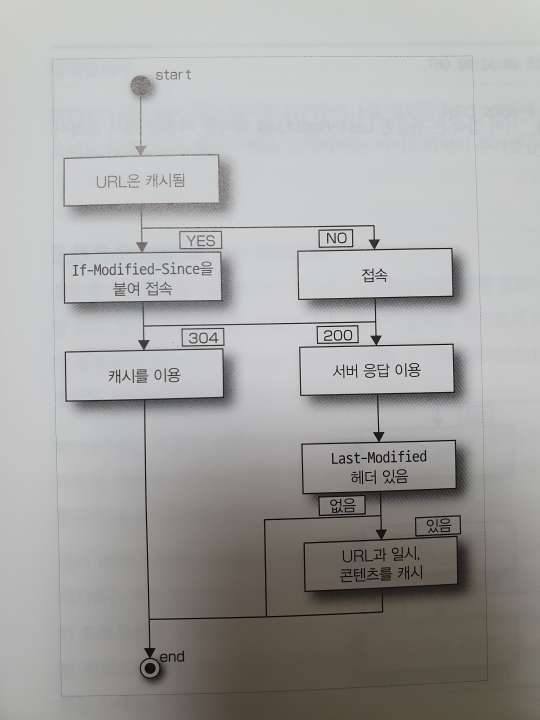
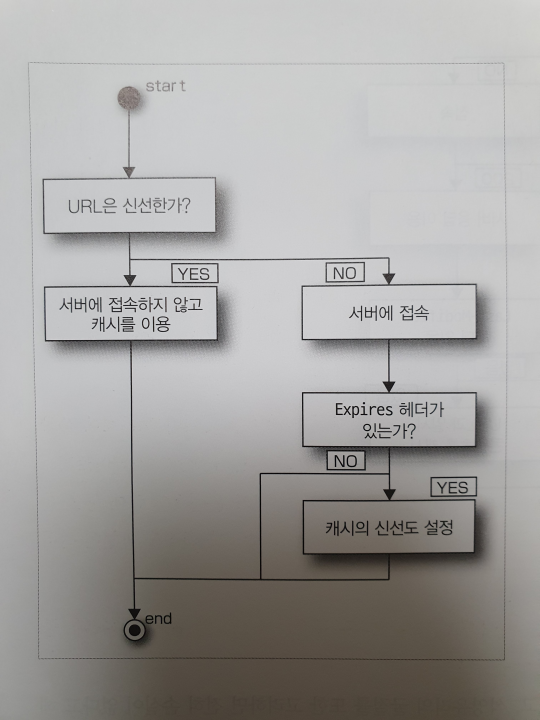
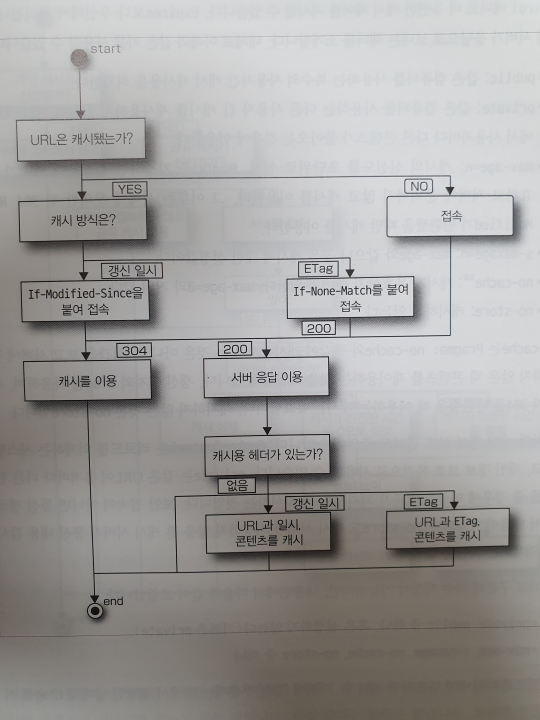
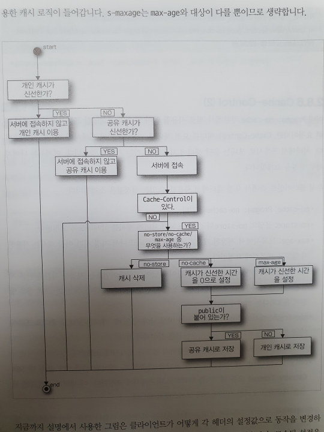
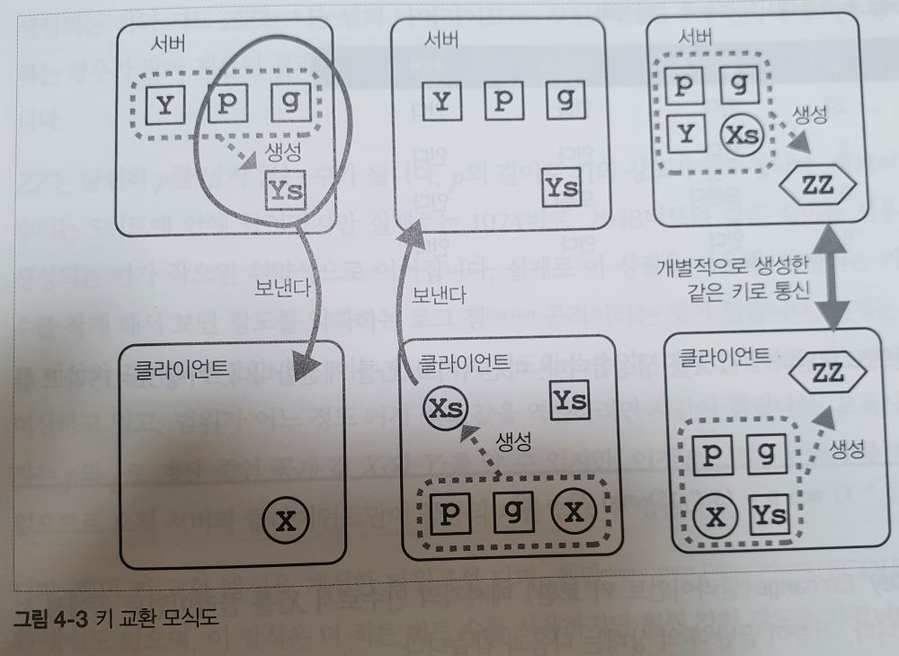
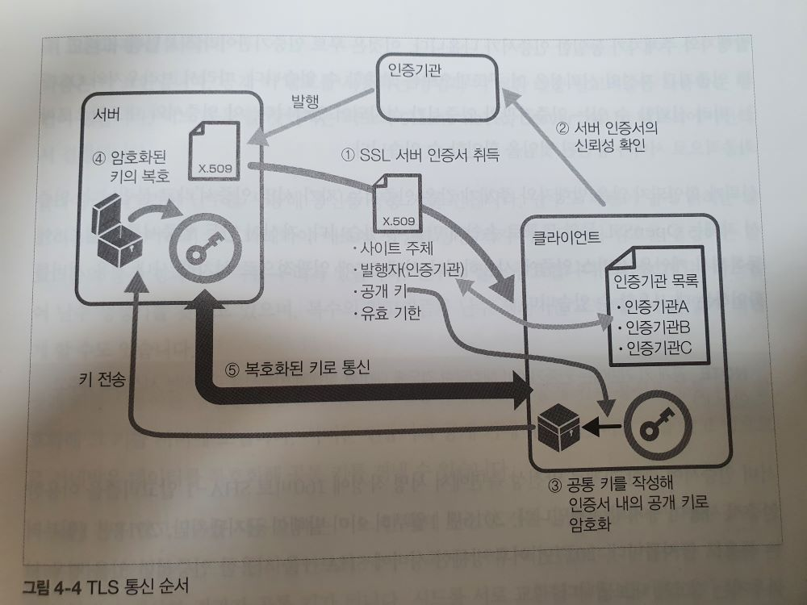

# 개요

* golang으로 서버 파트를 구현하고 curl 로 클라이언트 동작을 테스트하면서 HTTP 를 학습할 수 있는 책. 실습이 많은 점이 좋다.
* HTTP 2.0, QUIC, WebRTC 등의 주제는 그냥 소개만 하는 수준이라 HTTP 1.1 까지의 학습에 적합함.
* https://developer.mozilla.org/en-US/docs/Web/HTTP 도 정리가 잘 되어있다. 브라우저별 지원여부나 관련 RFC도 잘 정리 되어있어서 추후 레퍼런스로 참고하기에 매우 적합해보인다.

# Ch01 HTTP/1.0의 신택스: 기본이 되는 네 가지 요소

* 메서드와 경로
* 헤더
* 바디
* 스테이터스 코드

## 실습참고

```bash
go run echo-server.go
```

## http 기본 구조

```bash
# 헤더와 바디는 빈 개행으로 구분한다.
# 요청
[메서드] [경로] [프로토콜]
[헤더]

[바디]

# 요청 ex
POST / HTTP/1.1
Host: localhost:18888
User-Agent: curl/7.68.0

title=The%20%26%20Art&author=Bob

# 응답
[프로토콜] [스테이터스 코드 + 메시지]
[헤더]

[바디]

# 응답 ex
HTTP/1.1 200 OK
Content-Length: 32
Content-Type: text/html; charset=utf-8

<html><body>hello</body></html>
```

## curl 사용 샘플

```bash
# GET 메서드로 지정한 data를 urlencode하여 요청
# encode 요청은 브라우저나 curl과 같은 클라이언트에 따라 약간씩 다를 수 있음.
curl --get --data-urlencode "search world" http://localhost:18888

# 서버쪽 로그
# GET /?search%20word HTTP/1.1
# ...

# -v : req/resp 의 헤더를 포함해서 상세한 처리 내용을 보여줌
curl -v http://localhost:18888
```

## 헤더

* 헤더는 '파일명:값' 의 형식. 각 헤더는 한 줄에 하나씩 기술되며 본문과의 사이에는 빈 줄이 하나 있음
* 헤더는 대소문자를 구별하지 않음. 보통은 받는 쪽 라이브러리 나름대로 정규화하여 사용함.
  * 예를 들어 golang의 `net/http`는 `-` 을 구분자로하여 단어를 구분하고 각 단어의 시작은 대문자, 이후는 소문자로 정규화함. `ex. X-TEST -> X-Test`

```bash
curl -H "X-Test: Hello" http://localhost:18888
# RFC상 같은 이름의 헤더를 여러 번 보내는 것도 허용함
# 서버 프로그램에 따라 , 로 구분되는 결합 문자열로 다루거나 배열로 처리하기도 함
curl -H "X-Test: Hello" -H "X-Test: hihi" http://localhost:18888
# golang의 net/http라면 배열로 처리 "X-Test": []string{"Hello", "hihi"}
# python 장고는 {'HTTP_X_TEST': 'Hello,hihi'} 와 같이 정규화 된다고 함

# User-Agent 같이 자주 사용하는 헤더는 --user-agent (-A) 와 같이 alias가 제공됨
# 물론 -H로 직접 지정해도 됨
curl -v -A "Mozilla/5.0"  http://localhost:18888
curl -v -H "User-Agent: Mozilla/5.0"  http://localhost:18888
```

* 헤더는 요청이나 응답에만 사용되는 것, 양쪽 다 사용되는 것이 있음.
* 전체 헤더의 풀 스펙은 https://www.iana.org/assignments/message-headers/message-headers.xhtml 참고

## MIME 타입

* 파일의 종류를 구별하는 문자열, 원래는 전자메일을 위해 만들어짐.
```bash
# 웹 서버가 HTML을 보낼 경우의 응답 헤더 예제
Content-Type: text/html; charset=utf-8
```
* 사진이나 동영상과 같은 미디어는 브라우저, 환경에 따라 이용가능한 포맷이 일부 다름. 때문에 클라이언트와 서버는 다룰 수 있는 포맷에 관해 니고시에이션하고 실제로 반환할 파일 포맷을 변경함.
* content sniffing : IE는 옵션에 따라 MIME 타입이 아닌 내용을 보고 파일 형식을 추측하는 기능이 있음. 서버 설정이 잘못된 경우 이런 추측이 맞으면 장점인 경우도 있겠으나 `text/plain` 인데 스크립트가 들어있다고 브라우저가 멋대로 실행해버리는 경우가 발생하기도 했음. 따라서 보안상의 이유는 아래와 같은 헤더를 전송해 브라우저가 멋대로 MIME 을 추측하지 않도록 하는게 일반적
```
X-Content-Type-Options: nosniff
```
## 전자메일과 HTTP의 비교

* 헤더와 MIME 모두 원래는 전자메일을 위한 기술이었고 이를 HTTP에도 사용하게된 것임.
* 헤더 + 본문 구조는 동일함
* HTTP 요청에는 선두에 '메서드 + 패스' 행이 추가됨
* HTTP 응답에는 선두에 스테이터스 코드가 추가됨
* 그 외에 메일의 경우 긴 헤더가 있을 때 줄바꿈 규칙이 정의되어 있는 등 문법상의 자잘한 차이가 있음
* 그러나 기본은 동일하며 HTTP 통신은 고속으로 전자메일이 왕복하는 것이라고도 볼 수 있음.

## 뉴스그룹

* 메서드와 스테이터스 코드는 뉴스그룹으로부터 도입한것임.
* 즉, 전자메일와 뉴스그룹이 HTTP의 조상

## 메서드

* HTTP는 파일 시스템과 같은 설계 철학으로 만들어짐.
* 가장 흔하게 쓰이는 메서드는 아래 3가지
  * GET : 서버에 헤더와 콘텐츠 요청
  * HEAD : 서버에 헤더만 요청
  * POST : 새로운 문서 투고
* 1.0부터 정의되는 되어 있었지만 브라우저들이 XMLHttpRequest 를 지원하면서부터 사용하게된 메서드
  * PUT : 이미 존재하는 URL의 문서를 갱신
  * DELETE : 지정된 URL의 문서 삭제. 성공하면 삭제된 URL은 무효가 됨.
* 그 외에 1.0이나 1.1 이후로 삭제된 것들. 확실히 파일시스템을 고려한 메서드들이 보임.
  * LINK, UNLINK, CHECKOUT, CHECKIN, SEARCH 등

```bash
# --request= 또는 -X 로 메서드 지정
# 각 메서드별로 단축형도 있음 (ex. HEAD는 --head 혹은 -I)
# 메서드를 생략할 경우 다른 옵션에 따라 GET 이기도 하고 POST 일 때도 있음
## 보통 데이터 전송 옵션을 사용하면 POST가 기본이 됨
curl -X POST http://localhost:18888/greeting
```

## 스테이터스 코드

* 100번대 : 처리가 계속됨을 나타냄.
* 200번대 : 성공했을 때의 응답.
* 300번대 : 서버에서 클라이언트로의 명령. 오류가 아닌 정상처리의 범주. 리다이렉트나 캐시 이용을 지시함.
* 400번대 : 클라이언트가 보낸 요청에 오류가 있음.
* 500번대 : 서버 내부에서 오류가 발생함

## 리다이렉트

* 300번대 응답중 일부는 서버가 브라우저에게 리다이렉트를 지시할 때 사용
* 301 Moved Permanently, 302 Found, 303 See Other, 307 Temporary Redirect, 308 Moved Permanently
* 301, 308 : 요청된 페이지가 영구적으로 이동했을 때 사용. 검색 엔진도 이 응답을 받으면 기존 페이지의 평가를 새로운 페이지로 계승함
* 302, 307 : 일시적인 이동. 모바일 전용 사이트로 이동하거나 관리 페이지 표시 등에 사용.
* 303 : 요청된 페이지에 반환할 컨텐츠가 없거나 원래 반환할 페이지가 따로 있을 때 그쪽으로 이동시키려고 사용. 예를 들면, 로그인 페이지를 사용해 로그인한 후 원래 페이지로 이동하는 경우에 사용.
* 메서드 변경 : 첫 번째 요청이 POST이고, 두 번째 이후에 GET, HEAD를 사용할 경우 사용자에게 확이할 필요 없이 실시할 수 있는지여부
  * 301, 302는 허용, 303, 307, 308은 허가 필요
* 영구적/일시적
  * 301, 303, 308은 영구적, 302, 307은 일시적
* 캐시 
  * 301, 308은 함. 302, 307은 지시에 따름 (Cache-Control, Expires 헤더 등), 303은 캐싱 안함.

* 클라이언트는 Location 헤더를 보고 재전송함. 재전송할 때는 헤더 등도 다시 보냄.
* curl은 -L 옵션을 부여하면, 응답이 300번대고 Location 헤더가 있으면 Location 헤더에서 지정한 URL에 재전송을 수행함.

```bash
# 기본적으로 최대 50번까지 리다이렉트, --max-redirs 옵션으로 지정가능
curl -L http://localhost:18888
```

* 리다이렉트 횟수는 스펙상 정해진 제한은 없고 클라이언트가 리다이렉트 무한을 탐지해야함.
  * curl은 기본 50회 제한, golang에서는 10회 제한 등 구현에 따라 다름.
* 구글 권장은 5회 이하, 가능하면 3회 이하임.

## URL

* URL (Uniform Resource Locator) : 장소로 문서 등의 리소스를 특정하는 수단. 즉, 주소.
* URN (Uniform Resource Name) : `urn:ietf:rfc:1738` 과 같이 이름 그자체. 이름밖에 없으므로 실제 위치를 알려면 따로 정보가 필요.
* URI : URL, URN을 포함하는 개념. 웹에서 URN이 사용될 일이 없으므로 URL과 URI는 거의 같음.
* RFC 3305에서는 URL은 관용 표현, URI는 공식 표기로 정의했으나 실제로는 URL이 더 일반적으로 널리 쓰임. 언어에 따라서는 Ruby, C#은 URI 라 하는 반면 golang, python은 URL 을 사용함. 근데 JAVA는 URI, URL 클래스가 다 있음.

#### URL의 구조

* `스키마://호스트명/경로?쿼리` : 일반적인 형식
  * https://www.oreilly.co.kr/index.html?q=123
* `스키마://사용자:패스워드@호스트명:포트/경로#프래그먼트?쿼리` : 모든 요소를 포함한 경우
* 스키마의 해석은 브라우저와 같은 클라이언트의 책임
* 사용자, 패스워드 : Basic 인증 방식에 사용
* 프래그먼트 : HTML 페이지 내 링크의 앵커를 지정하는 데 사용
* 인코딩
  * URL은 기본적으로 ASCII 문자열로, 영문자, 숫자, 몇 개의 기호만 표시할 수 있음
  * RFC 2718 부터는 UTF-8로 URL을 인코딩하므로 다국어 문자도 다룰 수 있음.
* 스펙상 URL의 길이 제한은 없음. 근데 IE는 2083자까지 다를 수 있어 대체로 2000자 정도를 제한으로 봄. (내 의견 : IE 제외한 모던 브라우저들은 다를 지도. 그러나 애초에 URL이 2000자를 넘을정도면 URL 설계를 잘못했다고 본다.)
* HTTP2 에서는 URL이 지나치게 길 때 반환되는 스테이터스 코드 414 URI Too Long 이 추가됨.

#### URL과 국제화

* 퓨니코드를 사용하면 도메인 이름에 한글, 한자같은 문자를 다룰 수 있다.
* 실제로 UTF-8 같은 인코딩을 쓰는건 아니고 퓨니코드에서 지정한 규칙으로 변환하는 방식을 사용한다.
* 예를 들어 `한글도메인.kr` 을 퓨니코드로하면 `xn--bj0bj3i97fq8o5lq.kr` 이다.

## 바디 (Body)

#### 응답의 바디

* 읽어 올 바이트 수는 Content-Length 헤더로 지정한다.
  * Content-Encoding을 통해 압축된 경우 압축 후의 크기를 의미한다.
* HEAD 메서드 요청일 때도 Content-Length 헤더를 반환해야한다. 캐시용 ETag 등도 마찬가지.

#### 요청의 바디

```bash
# -d, --data, --data-ascii : 텍스트 데이터 (인코딩 없이 그대로 보냄)
# --data-urlencode : 텍스트 데이터 (curl 커맨드가 보내기 전 인코딩 수행)
# --data-binary : 바이너리 데이터
# -T 파일명 혹은 -d @파일명 : 보내고 싶은 데이터를 파일에서 읽음
# -d, --data-urlencode 는 기본적으로 application/x-www-form-urlencoded 으로 보냄

curl -d "name=bob" http://localhost:18888
curl -d "{\"hello\": \"world\"}" -H "Content-Type: application/json" http://localhost:18888
# test.json 
curl -d @test.json -H "Content-Type: application/json"  http://localhost:18888
```

* GET, HEAD, DELETE, OPTIONS, CONNECT 는 페이로드 바디를 가질 수는 있지만, 구현에 따라서는 서버가 이를 받아들이지 않을 수 있음 (RFC 7231)
* TRACE 는 "페이로드 바디를 포함해선 안 된다" 라고 강조되어있음

> 내의견 : 제대로된 요청이라면 GET 과 같은 메서드에 바디를 담아 보내서는 안 된다.

## 정리

* 메서드와 경로, 헤더, 바디, 스테이터스 코드는 HTTP의 기초
* 이는 HTTP/2 에서도 바뀌지 않았음.

# Ch02 HTTP/1.0의 시맨틱스: 브라우저 기본 기능의 이면

## 기본 form 전송 (x-www-form-urlencoded)

* form의 기본 전송 MIME 타입
* RFC에 x-www-form-urlencoded 타입인 경우의 파일전송동작은 정의되지 않았음.
  * 브라우저에서 해보면 파일명만 전달되고 파일은 전송되지 않음.

```html
<!--
- 브라우저는 RFC 1866에서 책정한 변환 포맷으로 변한한다.
- 알파벳, 숫자, 별(*), 하이픈(-), 마침표(.), 언더스코어(_) 의 여섯 종류 문자 외에는 변환 필요
- 예를 들어 공백은 + 로 바뀜
- 값으로 들어가는 =은 %3D, &는 %26으로 바뀌고 실제 구분자는 =, & 로 전달되므로 읽는 쪽에서 이를 구분할 수 있음

title=The & Art, author=Bob으로 요청한 경우의 바디
title=The+%26+Art&author=Bob
-->
<form action="http://localhost:18888" method="POST">
  <input name="title"/>
  <input name="author"/>
  <input type="submit"/>
</form>

<!-- 
 - method가 GET일 경우 바디가 아니라 쿼리로서 URL에 부여함 (RFC 1866 정의)
 GET /?title=The+%26+Art&author=Bob HTTP/1.1
-->
<form action="http://localhost:18888" method="GET">
<!-- 이하 동일 -->

<!--
쓸 일은 없겠으나 form은 text/plain 타입도 지원한다.
변환을 하지않으며, 개행으로 구분해 값을 전송한다.

title=The & Art
author=Bob
-->
<form action="http://localhost:18888" method="POST" enctype="text/plain">
<!-- 이하 동일 -->
```
```bash
# -d 는 인코딩을 하지 않고 그대로 보내므로 아래 예의 "The & Art" 같은 인코딩이 필요한건 보내면 안 된다.
curl -d title="The & Art" -d author="Bob" http://localhost:18888

# --data-urlencode 옵션은 브라우저와 유사하게 인코딩해서 보냄. 단, 브라우저와 달리 RFC 3986 에서 정의한 변환 방식을 사용함
# 예를 들어 공백이 + 가 아닌 %20 으로 변환됨

# title=The%20%26%20Art&author=Bob
curl --data-urlencode title="The & Art" --data-urlencode author="Bob" http://localhost:18888
```

* 웹 브라우저는 form 인코딩에 RFC 1866, curl은 데이터 인코딩에 RFC 3986 을 사용하지만 동일 알고리즘으로 복원할 수 있음

## form을 이용한 파일 전송 (multipart/form-data)

* RFC 1867에서 정의
* HTTP 바디는 일반적으로 한 파일 전체를 의미하고 단순히 Content-Length 만큼 읽으면 됨.
* 반면에 멀티파트는 이름 그대로 한 번의 요청으로 복수의 파일을 전송할 수 있음. 받는 쪽에서 복수의 파일을 구분하기 위한 방법이 필요함. 이를 위해 Content-Type 헤더에 boundary 라는 경계문자열을 부여함.

```html
<!-- 
- Content-Type에 부여되는 boundary 는 각 클라이언트가 랜덤으로 생성함
- boundary 값으로 body의 데이터를 분리하여 해석할 수 있음
- body 끝에는 [boundary값]-- 으로 끝남
- boundary로 구분되는 각 Part는 각각 헤더+빈줄+콘텐츠로 구성됨
- 각 파트에 Content-Disposition 헤더가 있는데 이를 통해 각 파트를 정의함
  - 내 의견) Disposition 은 기질, 성향, 배치 라는 뜻. 책 번역은 기질,성질이라고 해놨는데 배치(arrangement) 가 더 적절한 해석이라고 생각한다.
- 파일을 첨부해보면 Content-Type 헤더가 부여됨을 알 수 있음

[헤더들]
Content-Type: multipart/form-data; boundary=---------------------------340904805324056899591929825476
[나머지헤더들]

[이하 바디]

-----------------------------340904805324056899591929825476
Content-Disposition: form-data; name="title"

The & Art
-----------------------------340904805324056899591929825476
Content-Disposition: form-data; name="author"

Bob
-----------------------------340904805324056899591929825476
Content-Disposition: form-data; name="attachment"; filename="sample.txt"
Content-Type: text/plain

hello file
-----------------------------340904805324056899591929825476--  
-->

<form action="http://localhost:18888" method="POST" enctype="multipart/form-data">
  <input name="title"/>
  <input name="author"/>
  <input name="attachment" type="file">
  <input type="submit"/>
</form>
```

```bash
# curl은 -d 대신 -F 를 사용하면 multipart/form-data 로 전송함
# -d, -F는 함께 사용할 수 없음
# type, filename은 생략가능함. 이 경우 type은 자동 설정되고 filename은 로컬 파일명과 동일
: '
Content-Disposition: form-data; name="attachment"; filename="changed.txt"
Content-Type: application/json

{"hello": "world"}
'
curl -F "title=The & Art" -F author=Bob -F "attachment=@test.json;type=application/json;filename=changed.txt" http://localhost:18888

# =<[파일] 형식으로 파일을 첨부하는게 아니라 파일 내용을  보내는것도 가능
: '
Content-Disposition: form-data; name="attachment"
Content-Type: application/json

{"hello": "world"}
'
curl -F "title=The & Art" -F author=Bob -F "attachment=<test.json;type=application/json" http://localhost:18888

```

## form 을 이용한 리다이렉트

* 보통은 300번대 스테이터스 코드를 이용해서 리다이렉트를 수행함.
* 이 방법의 제한사항은
  * URL은 환경에 따라 길이 제한이 있을 수 있으므로 GET의 쿼리로 보낼 수 있는 데이터 양에는 한계가 있음
  * 데이터가 URL에 포함되므로 전송 내용이 액세스 로그 등에 남을 수 있음
* 이런 경우 form 을 이용한 리다이렉트를 사용할 수 있음

```html
<!-- body의 onload 이벤트를 활용한 간단한 구조 -->
<body onload="document.forms[0].submit()">
  <form action="http://localhost:18888/redirect" method="POST">
    <input type="hidden" name="data" value="i want to send this data" />
  </form>
</body>
```

* 전송가능한 데이터양에 제한이 없으므로 리다이렉트 전송할 데이터가 많을 때 유용함
* 순간적으로 빈 페이지가 표시될 수 있다는 게 단점.
> 내 의견 : 이라고 했지만 굳이 onload 이벤트를 안 해도 중간 페이지를 별도로 디자인하고 화면이 다 뜨고 적절한 UI를 보여준 후 리다이렉트해도 되므로 단점이라 볼 건 없는듯.
* 또 300번대 스테이터스 코드와 달리 클라이언트 환경에서 자바스크립트가 비활성화 되어있으면 자동 전환이 동작하지 않는것도 차이점.
* SOAP 형식의 조금 큰 XML 데이터를 암호화하여 리다이렉트할 필요가 있는 SAML, OpenID Connect 등에서 활용됨.

## 콘텐트 니고시에이션

* 통신 방법을 최적화하고자 하나의 요청 안에서 서버와 클라이언트가 서로 최고의 설정을 공유하는 시스템이 콘텐트 니고시에이션
* 아래 4개의 헤더를 사용함
  * Accept : MIME 타입을 협상함 / 응답 : Content-Type
  * Accept-Language : 표시 언어 협상 / 응답 : Content-Language 헤더, html 태그
  * Accept-Charset : 문자셋 / 응답 : Content-Type
  * Accept-Encoding : 바디압축 / 응답 : Content-Encoding

#### 파일 종류

* `Accept: image/webp,*/*;q=0.8`
  * webp를 지원하면 webp, 아니면 다른 포맷(우선 순위 0.8) 으로 줄 것을 서버에 요청하는 것
* q는 품질계수 (0~1, 1이면 생략)
* 서버는 요청에서 요구한 형식 중에서 우선순위를 해석하여 가장 일치하는 포맷으로 반환함.
* 서로 일치하는 형식이 없으면 서버가 406 Not Acceptable 오류를 반환함

> 내의견 : 이라고 되어있으나 실제 각종 서버에 엉뚱한 Accept 헤더를 날려보면 그냥 Accept 헤더를 무시하고 서버가 적절히 응답한다. 사용자경험상 더 편하기 때문일듯. 이건 Accept-Language 도 마찬가지. 문자셋과 인코딩도 마찬가지가 아닐까 싶다.

#### 표시 언어 결정

* `Accept-Language: ko-KR,ko;q=0.8,en;q=0.6`
  * ko-KR, ko, en 의 우선순위로 언어 요청
* 품질계수는 Accept와 동일
* 대응되는 헤더로 `Content-Language` 가 있으나 잘 안 쓰임

* HTML의 경우
```html
<!-- 대신 html 태그에 lang이 지정되는 경우는 종종 볼 수 있음 -->
<html lang="ko">
```

#### 문자셋 결정

* `Accept-Charset: utf-8;windows-949;q=0.7;*;q=0.3`
  * utf-8, windows-949, 아니면 그 외의 다른 인코딩으로 응답해줄 것을 요청
* 현대의 모던 브라우저들은 대부분 송신하지 않음. 저자 의견은 브라우저들이 모든 문자셋 인코더를 내장하고 있으므로 미리 네고시에이션을 할 필요가 없어졌기 때문이라 함.
* 컨텐츠의 문자셋은 `Content-Type: text/html; charset=UTF-8` 처럼 MIME타입과 세트로 `Content-Type` 에 실려 통지됨
* 사용할 수 있는 문자셋은 [IANA](https://www.iana.org/assignments/character-sets/character-sets.xhtml)에서 관리함

* HTML의 경우
```html
<!-- RFC 1866 HTML/2.0 스타일 -->
<meta http-equiv="Content-Type" content="text/html; charset=UTF-8">

<!-- HTML5 스타일 -->
<meta charset="UTF-8">
```

* 구글 홈페이지의 HTML 시작부분
```html
<!doctype html>
<html itemscope="" itemtype="http://schema.org/WebPage" lang="ko">
  <head>
    <meta charset="UTF-8">
    <!-- 이하 생략 -->
```

#### 압축을 이용한 통신 속도 향상

* 압축의 효과가 큰 리소스(텍스트 등)라면 압축을 통해 통신 비용(시간, 금액 등)을 절감할 수 있다.
* `Accept-Encoding: deflate, gzip`
  * deflate 또는 gzip 으로 압축하여 응답해줄 것을 요청
* 서버는 `Accept-Encoding` 헤더를 보고 지원가능한 인코딩으로 압축하여 응답한다.
*  `Content-Encoding: gzip`
  *  서버는 인코딩에 사용한 알고리즘을 `Content-Encoding` 헤더에 담아 응답한다.
  *  리소스가 인코딩된 경우의 `Content-Length` 값은 압축된 파일의 크기임
* 웹 브라우저에서 사용하는 주요 압축 알고리즘
  * deflate, gzip, br
  * compress, exi, identity (무압축을 선언하는 예약어)
  * sdch : Shared Dictionary Compressing for HTTP. 미리 교환한 사전을 이용한 압축방식. 크롬에서 쓰인다고 함 (IANA 등록 표준X).
    * 이와 같은 공유 사전 방식의 압축은 HTTP/2의 헤더 압축에도 쓰임.
* 이와 같은 Content-Encoding 은 압축을 통해 콘텐츠 크기를 줄이는 방식
* Transfer-Encoding 은 통신 경로를 압축하는 방법인데 그다지 쓰이지 않음.

```bash
# 버전에 따라 다른데 curl/7.68.0 에서는 --compressed 옵션을 사용하면 헤더에
#  Accept-Encoding: deflate, gzip, br
# 을 추가한다.
curl --compressed http://localhost:18888
```

> 내의견 :  이와 반대로 서버가 응답할 때 클라이언트에 Accept-Encoding을 주고 클라이언트에서 서버로 리소스를 보낼 때 압축해서 보내는 방식도 논의되고 있다고함. 21년기준으로 어떨지는 모르겠음. 근데 이건 자체구현하던 서버 기능으로 지원하면 될 일이라 필요에 따라 찾아서 적용하면 될 듯. 예를 들면 json 데이터를 서버로 빈번하게 보내는 사이트에서 유용할듯.

## 쿠키

* 웹사이트의 정보를 브라우저에 저장하는 작은 파일.
* 헤더를 기반으로 구현됨
* HTTP는 stateless 하지만 쿠키를 통해 stateful 처럼 보이게 서비스를 제공할 수 있음 

```
# 서버가 클라이언트에게 쿠키를 저장하도록 헤더에 지정한 경우
Set-Cookie: LAST_ACCESS_DATE=Jul/20/2019
Set-Cookie: LAST_ACCESS_TIME=12:04
```

* 기본적으로 `이름=값` 의 형식
* 클라이언트는 이 값을 저장해두고 다음 요청에는 아래와 같이 전달

```
Cookie: LAST_ACCESS_DATE=Jul/20/2019; LAST_ACCESS_TIME=12:04
```

```bash
# -c : 수신한 쿠키를 지정한 파일에 저장
# -b : 지정한 파일에서 쿠키를 읽어와 전송
# -c, -b를 동시에 사용하면 브라우저처럼 동시에 송수신가능
curl -v -c cookie.txt -b cookie.txt http://localhost:18888/cookie

# -b 는 개별 쿠키 추가에도 사용할 수 있음
curl -v -c cookie.txt -b cookie.txt -b "ABC=MYCOOKIE" http://localhost:18888/cookie
```

#### 쿠키의 잘못된 사용법

* 쿠키는 브라우저 설정에 따라 언제든지 삭제될 수 있고 심지어 아예 저장되지 않을 수도 있음. 따라서 사라지더라도 문제가 없는 정보나 서버로부터 복구 가능한 데이터를 저장하는데 적합함.
* 쿠키의 최대 크기는 4KB 로 정해져 있으므로 주의 필요.
* 쿠키는 항상 통신에 부가되므로 그만큼 전체적인 통신 비용을 높임.
* HTTP 에서는 평문으로 노출되므로 주의. 또한 암호화를 하더라도 사용자가 자유롭게 제어가능하므로 민감한 정보를 저장하는 용도로 사용하면 안 됨

#### 쿠키에 제약을 주다 - 쿠키 옵션

* 기본 양식인 `이름=값` 뒤에 세미콜론을 구분자로 다양한 옵션을 추가할 수 있음.
  * 대소문자 구분 안 함
* 설명에서 알 수 있듯 보안을 위한 옵션이 대부분
  * Expires : 쿠키의 수명설정. `Wed, 26-May-2021 08:11:54 GMT` 형식
  * Max-Age : 초 단위로 지정. 현재 시각에서 지정된 초수를 더한 시간에 쿠키가 만료됨.
  * Domain : 클라이언트에서 쿠키를 전송할 대상 서버. 생략하면 쿠키 발행 서버.
  * Path : 클라이언트에서 쿠키를 전송할 대상 서버의 경로. 생략하면 쿠키를 발행한 서버 경로.
  * Secure : https 일 때만 서버로 쿠키를 전송함.
  * HttpOnly : 자바스크립트 엔진으로부터 쿠키를 숨김. XSS 등의 공격에 대한 방어책.
  * SameSite : RFC에는 없고 크롬에 있는 기능. 같은 오리진(출처)의 도메인에 전송하게 함.

```bash
# ex
Set-Cookie: 1P_JAR=2021-04-26-08; expires=Wed, 26-May-2021 08:11:54 GMT; path=/; domain=.google.com; Secure; SameSite=none
```

## 인증과 세션

* Basic 인증 : 가장 간단한 인증방식
  * 유저명, 패스워드를 BASE64로 인코딩하여 전송. 평문으로 감청될 경우 손쉽게 인증정보가 탈취됨.
  * base64(유저명 + ":" + 패스워드)
```bash
# 기본인증방식이 basic이므로 --basic 생략가능 
curl --basic -u user1:pw123! http://localhost:1888

# 서버단 헤더
# ...
# Authorization: Basic dXNlcjE6cHcxMjMh
```

* Digest 인증 : 해시함수를 이용함 
  * id, pw, uri, 요청마다 달라지는 nonce 값 등으로 계산한 해시값을 사용하므로 노출되도 복호화가 어려움
```bash
curl --digest -u user1:pw123! http://localhost:18888
```

* Basic, Digest 인증 모두 일반적으로는 쓰이지 않음
  * 특정 경로 아래를 보여주지 않는 방식으로만 인증 가능. 이 때문에 톱페이지부터 인증이 되야 표시가 가능함.
  * 요청할 때마다 인증정보를 보내야함
  * 로그인 화면의 사용자화가 불가함
  * 명시적인 로그오프가 불가함
  * 로그인한 단말을 식별할 수 없음. 동시 로그인 불가 등의 기능을 구현할 수 없음.
* 이 때문에 흔히 알고 있듯 form을 이용해 ID/PW (+2차 인증 등) 로 1회 로그인하고 서버는 세션 토큰 `(JSESSIONID 등)` 을 발행함. 세션 토큰은 쿠키로 클라이언트에 발급되고 클라이언트는 이후의 요청에 쿠키를 전송함으로서 로그인 상태가 유지됨. 사이트간 요청 위조 (Cross-Site Request Forgery, CSRF) 대책으로 랜덤 키를 같이 보내기도 함.

> 책에서는 서명된 쿠키를 이용한 세션 데이터 저장도 소개했음. 통신 속도가 빨라진 만큼 쿠키의 데이터양 증가는 큰 문제가 아니니 쿠키에 세션 정보 전체를 저장하고 서버에는 세션 스토리지를 두지 않는다는 아이디어임. 쿠키값 위조가 걱정되는데 이는 쿠키값을 서버만 가지고 있는 공개키, 비밀키로 암호화하는 방식으로 해결한다고 함. 모든 키를 서버가 가지고 있으므로 클라이언트가 변조해봐야 서버는 이를 즉시 알아차릴 수 있을 것임. 또한 세션 스토리지 암호화 방식만 공통화해두면 마이크로서비스에서도 사용할 수 있을만큼 범용성도 좋음. 루비 온 레일즈나 장고에서 지원한다고 함. 장점은 서버측에 세션 스토리지를 두지 않아도 된다는 점이고 단점은 네트워크 트래픽의 증가와 같은 사용자가 다른 클라이언트로 접속했을 때 데이터 공유가 어렵다는 점.

> 내의견) 서버에서 세션 스토리지를 두려면 HA 구성이든 뭐든 돈이 드는데 이 방식을 도입한 비용절감 효과가 네트워크 트래픽 증가에 따른 비용보다 크다면 나름 도입할만한 방법인 것 같다. 근데 또 떠오른 단점은 현재 접속한 세션수를 세는게 어렵겠다.

## 프록시

* HTTP/1.0 에서는 프록시와 게이트웨이를 다음과 같이 정의한다.
  * 프록시 : 통신 내용을 이해한다. 필요에 따라서 콘텐츠를 수정하거나 서버 대신 응답한다.
    * ex) 컨텐츠 캐싱, 외부 공격으로부터 네트워크를 보호하는 방화벽 역할, 저속 통신 회선용으로 데이터 압축하는 필터나 콘텐츠 필터링 등
  * 게이트웨이 : 통신 내용을 그대로 전송한다. 내용의 수정도 불허한다. 클라이언트에서는 중간에 존재하는 것을 알아채서는 안 된다.
* HTTPS 통신의 프록시 지원은 HTTP/1.1에서 추가된 CONNECT 메서드를 이용함

* 프록시 구조는 단순해서 GET 등의 메서드 다음에 오는 경로명 형식만 바꿈.

```bash
# 원래 요청
GET /helloworld
Host: localhost:18888

# 프록시를 설정하면 요청 경로에 스키마가 추가되므로 URL 형식이 됨
GET http://example.com/helloworld
Host: localhost:18888
```

* 프록시 서버로 보내는 경우. 프록시는 이를 받아 중계할 곳으로 요청을 리디렉트하고 결과를 클라이언트에 반환함
* 프록시 서버에서 인증을 사용하는 경우 프록시 서버는 `Proxy-Authenticate` 헤더로 인증이 필요함을 클라이언트에게 알리고 클라이언트는 인증정보를 `Proxy-Authorization` 에 담아 전송함.
* 중계되는 프록시는 중간의 호스트 IP 주소를 특정 헤더에 기록함. 옛날부터 쓰던 비표준은 `X-Forwarded-For` 헤더이고 표준은 RFC 7239에 추가된 `Forwarded` 헤더임. 다만 남길지 말지는 프록시 서버 마음이므로 그대로 믿으면 안 됨.
```
X-Forwarded-For: client, proxy1, proxy2
```

```bash
# -x/--proxy : 프록시 서버를 지정함
# -U/--proxy-user 프록시 서버 인증정보
# --proxy-basic, --proxy-digest 등으로 프록시 인증 방식 변경 가능
curl -x http://localhost:18888 -U user:pass http://google.com/

':
GET http://google.com/ HTTP/1.1
Accept: */*
Proxy-Authorization: Basic dXNlcjpwYXNz
Proxy-Connection: Keep-Alive
User-Agent: curl/7.68.0
'
```

## 캐시

#### 갱신일자에 따른 캐시

* HTTP/1.0 시절에는 정적 콘텐츠 위주이므로 콘텐츠가 갱신됐는지만 비교하면 충분했음

```bash
# 웹서버는 아래 헤더를 응답에 포함시킴.
# 날짜는 RFC 1123 으로 기술되며, 타임존에는 GMT를 설정
Last-Modified: Wed, 08 Jun 2020 15:23:45 GMT

# 웹 브라우저는 캐시된 URL을 다시 읽을 때 서버가 반환한 Last-Modified 값을 그대로 아래 헤더에 담아 요청함
If-Modified-Since: Wed, 08 Jun 2020 15:23:45 GMT

# 콘텐츠가 변경됐으면 200 OK 응답과 함께 콘텐츠를 응답 바디에 실어서 보냄
# 변경되지 않았으면 304 Not Modified 를 반환하고 바디를 응답에 포함하지 않음
```



#### Expires

* `Last-Modified`, `If-Modified-Since` 을 이용한 방식은 어쨋든 서버로 요청이 발생함
* Expires 는 콘텐츠의 유효기간을 정함으로써 지정한 기간 내에는 강제로 캐시를 이용하도록 하고 서버로 요청을 아예 전송하지 않음
* 엄밀히는 Expires 에 지정된 시간은 서버에 접속을 할지 말지 판단할 때만 사용함
* 또한 브라우저의 "뒤로 가기 버튼" 등으로 방문 이력을 조작하는 경우는 기한이 지난 오래된 콘텐츠가 그대로 이용될 수도 있음
* 지정된 시간까지는 서버에 아예 요청을 보내지 않으므로 주의해서 사용해야함. RFC 2068 에서는 변경할 일이 없더라도 최대 1년의 캐시 수명을 설정하자고 가이드하고 있음.

```bash
# 지정된 시간 이내에 재요청이 발생하면 서버로 요청하지 않고 가지고 있는 캐시를 그대로 사용
# 이후에 재요청이 발생하면 서버에 재요청
Expires: Wed, 08 Jun 2020 15:23:45 GMT
```

> 내의견 : Expires 를 사용하더라도 해당 콘텐츠를 로드하는 페이지 자체는 캐싱을 하지 않도록 설정해두고 그 페이지에서 Expires 헤더를 사용한 콘텐츠의 url 뒤에 ?v=20210508 과 같은 파라미터를 붙이면 URL이 달라지므로 다시 서버로 요청이 들어간다. 

* 아래 그림에서 "서버에 접속"은 전술한 `Last-Modified` 헤더를 이용한 캐시 로직이 들어감



#### Pragma: no-cache

* Pragma는 지시를 포함한 요청 헤더가 들어가는 헤더
* Pragma 헤더에 포함할 수 있는 페이로드로 유일하게 HTTP 사양으로 정의된 것이 no-cache
* no-cache는 "요청한 콘텐츠가 이미 저장돼 있어도, 원래 서버(오리진 서버)에서 가져오라" 고 프록시 서버에 지시하는 것. HTTP/1.1 에서 Cache-Control로 통합됐으나 하휘 호환성 유지를 위해 남아있음
* 프록시가 요청한 대로 처리하리라는 보장은 없음. 중간에서 프록시가 하나라도 no-cache를 무시하면 기대한 대로 동작하지 않음.
* HTTP/2 부터는 프록시가 통신 내용을 감시할 수 없고 중계만할 수 있으므로 프록시의 캐시를 외부에서 관리하는 의미는 이제 없다고도 말할 수 있음 
* 이런 이유로 별로 사용되지 않음

#### ETag

* 날짜와 시간을 이용한 캐시 비교만으로는 해결할 수 없는 상황도 있음
* 동적으로 바뀌는 요소가 늘어날수록 날짜를 근거로 캐시의 유효성을 판단하기 어려움
  * 사용자마자 화면 구성이 동적으로 달라지는 사이트 등
* RFC 2068의 HTTP/1.1에서 ETag(Entity Tag) 가 추가됨. 이 값은 순차적인 갱신 일시가 아니라 파일의 해시 값으로 비교함
* 서버는 응답에 `ETag` 헤더를 부여함. 두 번째 이후 요청시 클라이언트는 `If-None-Match` 헤더에 캐시에 있던 ETag 값을 추가해 요청함. 서버는 파일의 ETag 값과 비교해 같으면 304 Not Modified 로 응답함. 즉, 비교값만 달라졌을 뿐 `Last-Modified` 를 사용한 방식과 동일함.
* 대신 ETag는 서버가 자유롭게 결정해서 반환할 수 있음.
  * 콘텐츠 파일의 해시값, "갱신일시-파일크기" 형식의 스트링 등
  * 과거에는 inode 값을 사용한 적도 있었는데 서버를 여러 대 병렬시킨 경우 같은 콘텐츠인데도 id가 달라 ETag도 달라지므로 현재는 사용하지 않는 방식임



#### Cache-Control (1)

* ETag와 같이 HTTP/1.1에 추가됨
* 더 유연한 캐시 제어를 지시할 수 있음
* Expires보다 우선해서 처리됨

---

* 서버에서 응답을 보낼 때는 아래와 같은 키를 사용할 수 있음
  * public : 같은 컴퓨터를 사용하는 복수의 사용자간 캐시 재사용 허가
  * private : 같은 컴퓨터를 사용하는 다른 사용자간 캐시 재사용하지 않음. 같은 URL에서 사용자마자 다른 컨텐츠가 돌아오는 경우 이용
  * max-age=n : 캐시의 신선도를 초단위로 설정. 86400이면 하루동안 캐시가 유효하고 서버에 문의하지 않고 캐시를 이용함. Expires의 역할을 한다고 볼 수 있음. 그 이후는 서버에 문의한 뒤 304 Not Modified 가 반환됐을 때만 캐시를 이용함
  * s-maxage=n : max-age와 동일하나 공유 캐시에 대한 설정값
  * no-cache : 캐시가 유효한지 매번 문의함. max-age=0가 거의 동일함.
  * no-store : 캐시하지 않음
* no-cache는 캐시하지 않는다는 말이 아니고 항상 서버로 문의하여 갱신 일자와 ETag를 사용한 캐시 정책을 사용하겠다는 의미임. 캐시하지 않는 것은 no-store 임.
* 콤마로 구분해 복수 지정이 가능함. 보통 아래와 같이 조합
  * private, public 중 하나. 혹은 생략 (기본값 private)
  * max-age, s-maxage, no-cache, no-store 중 하나

```bash
#구글 메인화면의 js 중 하나의 캐시 관련 헤더
cache-control: public, max-age=31536000
expires: Sun, 08 May 2022 01:44:52 GMT
last-modified: Fri, 07 May 2021 20:29:55 GMT
vary: Accept-Encoding
```

---

* 아래를 포함한 cache 설명 이미지는 설명을 위한 대략적인 설명이며 항상 맞다는 보증은 없음. 예를 들어 모순된 설정을 동시에 할 경우 (no-cache와 max-age) 의 우선순위까지는 RFC에 적혀있지 않음.



#### Cache-Control (2)

* `Cache-Control` 헤더는 클라이언트 요청헤더로 쓰일 때는 `Pragma: no-cache` 처럼 프록시에 다양한 지시를 할 수 있음
    * no-cache: `Pragma: no-cache`와 동일
    * no-store : 응답의 no-store와 같고, 프록시 서버에 캐시를 삭제하도록 요청
    * max-age : 프록시에서 저장된 캐시가 최초로 저장되고 나서 지정 시간 이상 캐시는 사용하지 않도록 프록시에 요청
    * max-stale, min-fresh, no-transform, only-if-cached 등

---

* 한편 응답 헤더에서 서버도 프록시에게 캐시 컨트롤 지시를 내릴 수 있음. 물론 전항의 서버에서 클라이언트로 보내는 지시에서 소개한 명령은 모두 프록시에도 유효하고 아래 키들은 프록시 서버를 위한 전용 명령들임
  * no-transform : 프록시가 콘텐츠를 변경하는 것을 제어함
  * must-revalidate, proxy-revalidate 등

#### Vary

* 같은 URL 이라도 클라이언트에 따라 반환 결과가 다름을 나타내는 헤더
* 예를 들어 모바일 브라우저, 데스크탑 브라우저에 따라 표시가 달라질 수 있음
* 이처럼 표시가 바뀌는 이유에 해당하는 헤더명을 Vary 헤더에 나열함으로써 잘못된 콘텐츠의 캐시로 사용되지 않게 함

```bash
# User-Agent와 Accept-Language에 따라 콘텐츠가 달라질 수 있음을 명시
Vary: User-Agent, Accept-Language
```

* 참고로 User-Agent 는 관례일 뿐 정규화된 정보가 아니므로 판정이 틀릴 수도 있음.  2017년 구글 가이드라인에서는 같은 콘텐츠 (HTML, CSS, JS) 를 모든 브라우저에 배포하고, 브라우저가 필요한 설정을 선택하는 반응형 웹 디자인을 권장함.

## 리퍼러 (Referer)

* 사용자가 어느 경로로 서버에 도달했는지 파악할 수 있도록 클라이언트가 서버에 보내는 헤더.
* 원래 스펠링은 referrer 인데 RFC 1945 제안 당시의 오자가 남은 것이라고함.
* GET 파라미터에 개인정보 등 민감한 정보가 있을 경우 리퍼러를 통해 타사이트로 그대로 유출될 수 있으므로 파라미터에 민감한 정보가 노출되지 않도록 해야함.
* 리퍼러의 용도 예제
  * 어떤 사이트로부터 우리 서비스로 들어온건지 파악할 때 사용
  * 이미지가 타사이트에 직접 링크되는 것을 막을 때 사용
  * CSRF 방어 목적으로도 사용했으나 브라우저에서 리퍼러를 전송하지 않도록 설정할 수도 있으므로 권장하지 않음

```bash
# 구글에서 검색 후 결과 페이지에서 특정 사이트로 이동하면 해당 요청에는 아래와 같은 Referer 가 실린다.
Referer: https://www.google.com/

# 구글 검색결과 페이지에는 아래의 referrer 정책이 정의되어있으므로 도메인 이름만 전송되었음을 알 수 있다.
# ... <meta content="origin" name="referrer"> ...
```

* 스키마 조합과 리퍼러의 유무

|액세스 출발지|액세스 목적지|리퍼러를 전송하는가?|
|---|---|---|
|HTTPS|HTTPS|한다|
|HTTPS|HTTP|하지 않는다|
|HTTP|HTTPS|한다|
|HTTPS|HTTPS|한다|

* 대부분의 브라우저는 이 규칙을 준수함. 단, 이 규칙을 엄밀히 적용할 경우 서비스간 연계에 차질이 생기기도 해서 IE, 낮은 버전의 안드로이드 브라우저 등 준수하지 않는 브라우저도 존재함.

---

* 리퍼러 정책 설정 방법 (Referrer 로 오자가 수정됐으므로 주의)
  * Referrer-Policy 헤더
  * Content-Security-Policy 헤더
  * `<meta name="referrer" content="설정값">` 태그
  * `<a>` 태그 등 몇 가지 요소의 referrerpolicy 속성 및 `rel="noreferrer" 속성
* 정책 설정 값 예제
  * no-referrer : 전혀 보내지 않음
  * no-referrer-when-downgrade : 현재 기본 동작처럼 HTTPS -> HTTP 일 때는 전송하지 않음
  * same-origin : 동일 도메인 내의 링크에 대해서만 전송
  * origin : 도메인 이름만 전송
  * strict-origin : origin과 같지만 HTTPS -> HTTP 일 때는 전송하지 않음
  * origin-when-crossorigin : 같은 도메인 내에서는 완전한 리퍼러를, 다른 도메인에는 도메인 이름만 전송
  * strict-origin-when-crossorigin : origin-when-crossorigin :과 같지만 HTTPS -> HTTP 일 때는 전송하지 않음
  * unsafe-url : 항상 전송

---

* Content-Security-Policy 예제
* CSP 헤더는 다양한 보안 설정을 한번에 변경할 수 있는 헤더임. 10장에서 자세히 설명함.

```bash
Content-Security-Policy: referrer origin
```

## 검색 엔진용 컨텐츠 접근 제어

* 크롤러(로봇, 봇, 스파이더 등)의 접근을 제어하는 방법을 주로 다음 두 가지가 쓰임
  * robots.txt
  * sitemap
* 미국 재판에서는 robots.txt 가 법적 효력을 가진다는 판례가 여러개 있다고 함. 자세한건 robots.txt 웹사이트 참고

```bash
# robots.txt 예제
User-agent: *
Disallow: /service/

# 메타태그로도 설정 가능
# 아래 예제는 검색엔진이 인덱스하는 것을 거부함을 의미
<meta name="robots" content="noindex">
```
---

* sitemap은 웹사이트에 포함된 페이지 목록과 메타데이터를 제공하는 XML 파일
  * https://www.sitemaps.org
* 주로 검색 엔진에 정보를 제공하는 용도임

## 마치며

* HTTP는 효율적으로 계층화되어 있음. 통신의 데이터 상자 부분은 변하지 않으므로, 규격에서 제안된 새로운 기능이 구현되지 않아도 호환성을 유지하기 쉽도록 되어 있음. 또한 압축 방식 선택 등 브라우저가 규격화되지 않은 방식을 새로 지원해도 가능하다면 사용할 수 있음. 토대가 되는 문법(신택스)과 그 문법을 바탕으로 한 헤더의 의미 해석(시맨틱스)이 분리되어 있으므로 상위 호환성과 하위 호환성이 모두 유지됨.

# Ch03 Go 언어를 이용한 HTTP/1.0 클라이언트 구현

* 이 장은 curl 로 해본 예제들을 Go 언어로 구현해보는 파트이므로 별도 정리는 생략함

# Ch04 HTTP/1.1의 신택스: 고속화와 안정성을 추구한 확장

* HTTP 1.1 이후에도 HTTP의 틀과 구조는 크게 변하지 않음
* HTTP/2 는 주로 통신 고속화 등 저수준 커뮤니케이션 신택스에 특화되어있음.
* 즉, 통신 내용이나 브라우저와 서버 간의 커뮤니케이션 시멘틱스 사양으로는 HTTP/1.1 의 사양이 지금도 현역

---

* 주요 변경사항은 다음과 같음
* 통신고속화
  * Keep-Alive 가 기본적으로 유효
  * 파이프라이닝
* TLS에 의한 암호화 통신 지원
* 새 메서드 추가
  * PUT, DELETE 가 필수 메서드가 됨
  * OPTION, TRACE, CONNECT 메서드 추가
* 프로토콜 업그레이드
* 이름을 사용한 가상 호스트 지원
* 크기를 사전에 알 수 없는 콘텐츠의 청크 전송 인코딩 지원

## 4.1 통신 고속화

#### Keep-Alive

* Keep-Alive가 없었을 때는 하나의 요청마다 소켓을 매번 새로 만들어야 했음
* Keep-Alive는 한 번 만든 소켓을 연속된 요청에 계속 사용하여 TCP/IP 통신을 효율화하는 방법
* HTTP 에서 소켓 수립과정(3 way handshake)이 1.5회 왕복해야하고 1.5RTT (round-trip-time)로 표현
* TLS 에서는 핸드셰이크 과정이 2RTT 만큼 소요됨
* Keep-Alive 를 사용하면 소켓을 계속사용하므로 핸드셰이크 비용이 최소화되는 것

---

* HTTP/1.0 시절에는 일부 브라우저가 지원했고 아래의 헤더를 명시적으로 지정했었음. 만약 서버도 지원하면 응답헤더에도 같은 헤더를 보냈었음.
```
Connection: Keep-Alive
```
* HTTP/1.1 에서는 기본 동작이므로 생략 가능
* Keep-Alive 통신은 클라이언트나 서버 중 한 쪽이 다음 헤더를 부여해 접속을 끊거나 타임아웃될 때까지 연결이 유지됨
```
Connection: Close
```
* 하지만 실제 환경에서는 모든 통신이 확실히 끝났는지 서버, 클라이언트 모두 판정하기 어려우므로 실제로는 타임아웃으로 접속이 끊어지기를 기다리는게 일반적임.
* Keep-Alive Timeout은 클라이언트, 서버가 모두 가지고 있음. 어느쪽이든 먼저 끊으면 통신은 완료되므로 둘 중에서 짧은 쪽이 사용된다고 볼 수 있음.
  * 클라이언트 예 : IE는 60초, 파이어폭스는 115초
  * 서버 예 : nginX 75초, Apache 2.0 15초, Apache 2.2+ 5초
* Keep-Alive 소켓이 살아있는 동안 OS 자원을 점유하는 것이므로 타임아웃을 무작정 길게 설정해서는 안 되고 서비스에 따라 적절히 설정하는 것이 중요.

---

* curl을 이용할 경우 복수의 요청을 나열하면 Keep-Alive 를 사용함
```bash
# netstat 등으로 모니터링해보면 소켓을 하나만 사용함 
# Keep-Alive가 쓰였음을 알 수 있음
curl -v http://google.com http://google.com

# 두 번에 나눠서 보내면 소켓을 두 개 사용함
curl -v http://google.com
curl -v http://google.com
```

#### 파이프라이닝

* HTTP/1.1 에서는 유명무실한 기능이나 HTTP/2.0 에서는 개선되어 잘 쓰이고 있음
* 기본컨셉은 최초의 요청이 완료되기 전에 다음 요청을 보내는 기술임. 다음 요청까지의 대기 시간을 없앰으로써 네트워크 가동률을 높인다는 컨셉. Keep-Alive 사용을 전제로하고 서버는 요청이 들어온 순서대로 응답을 반환함.
* 그러나 다음의 이유로 실제로는 잘 쓰이지 않음
  * 중간에 HTTP/1.0 만 해석하는 프록시가 있으면 제대로 동작하지 않는다.
  * 서버가 제대로 구현을 하지 못 하는 경우가 있다.
  * 브라우저가 구현하지 않았거나 구현했어도 기본 설정이 OFF인 브라우저도 있다.
  * 실제로 써봐도 딱히 성능이 좋아지지 않는다는 보고도 있음
    * 요청받은 순서대로 응답해야하므로 응답 생성이 오래걸리거나 크기가 큰 파일을 반환하는 처리가 있으면 다른 응답에도 영향을 줌. 이는 HOL(Head-of-line) Blocking 이라는 문제로 알려짐.
* curl은 파이프라이닝 지원 안 함. 다만 libcurl 라이브러리에는 파이프라이닝을 이용하는 옵션이 준비되어 있음.

---

* 파이프라이닝은 HTTP/2 에서 스트림이라는 새로운 구조로 개선되어 쓰이고 있음
* HTTP/2 에서는 HTTPS 통신이 기본 전제임. HTTPS는 기본적으로 프록시가 송수신되는 데이터 내부를 볼 수 없고 단순히 중계만 하기 때문에 최신 프로토콜을 해석할 수 없는 프록시가 중간에 있어도 방해받을 일이 없음.
* HTTP/2의 스트림은 통신 순서를 유지해야 한다는 제약이 없음. HTTP/2에서는 하나의 세션 안에 복수의 스트림이 공존함. 시분할로 각 스트림의 통신이 이루어지므로 서버 측의 준비가 된 순서로 응답을 반환할 수 있음. 또한 우선순위를 부여해 순서를 바꾸는 것도 기능에 포함되었음.

## 전송 보안 계층 (TLS)

* 통신 경로를 암호화하는 전송 계층 보안 (Transport Layer Security) 
* HTTP/1.0 시절에 이미 보안 소켓 계층 (Secure Sockets Layer, SSL) 3.0이 넷스케이프 내비게이터에 탑재되어 있었음
* TLS는 SSL 3.0을 바탕으로 HTTP/1.0 이 탄생한 1996년에 표준화가 시작되어 HTTP/1.1 이후 표준화가 완료됨
* HTTP/1.1과 함께 사용하는 것을 의식하여 만들어졌지만 HTTP뿐만 아니라 다양한 형식의 프로토콜에 통신 경로의 안정성을 추가해 새로운 프로토콜을 만들어낼 수 있는 범용적인 구조를 가짐
  * 예를 들면 HTTPS 외에도 SMTP의 TLS 버전인 SMTPS 가 존재함
* HTTP 통신을 중계하는 게이트웨이 입장에서는 '암호화되어 통신 내용을 엿보거나 변경할 수 없는 양방향 통신'임
  * HTTP/1.0, 1.1 에서는 프록시 서버 등이 통신을 해석해 다양한 기능을 제공할 수 있었던 반면 해석할 수 없는 프로토콜을 멈춰버리는 문제가 있기도 했음
  * TLS를 사용하면 통신 내용을 알 수 없으므로 웹소켓이나 HTTP/2.0 처럼 HTTP/1.1 이전과 상위 호환성이 없는 수많은 새로운 시스템을 원만하게 도입하는 인프라가 되었음
* TLS는 흔히 과거의 잔재로 SSL로 불리기도 함. 예를 들면 TLS 관련 유명한 라이브러리 이름이 `OpenSSL` 인 것. 다만 실제 SSL은 보안취약성으로 인해 현재는 무효화됐거나 사용이 권장되지 않음.
* TLS 1.0부터 시작하여 21년 기준 최신은 1.3임 (18년에 RFC 책정)

---

```bash
# --tlsv1.0, --tlsv1.1, --tlsv1.2, --tlsv1.3 : TLS 니고시에이션할 때 지정한 버전으로 연결하도록 강제
curl --tlsv1.3 https://google.com

# --cert-status : 인증서를 확인한다. -v와 함께 사용
curl -v --cert-status https://google.com

# -k, --insecure : 자가 서명 인증서라도 오류가 되지 않는다.
# 대상 호스트 확인은 생략하고 통신 경로 암호화만 이용한다고 볼 수 있음
```

#### 해시 함수

* 암호화 통신을 위한 수학적 특성
* 해시 함수를 `h`, 입력데이터 `A,B`, 산출된 해시값 `X,Y` 라 할 때
  1. 같은 알고리즘과 입력데이터일 때 생성되는 해시값은 늘 같다. `h(A)=X` 임을 항상 보장.
  2. 같은 알고리즘이면 입력데이터 길이에 관계없이 해시값의 길이가 고정된다. 예를 들어 `SHA-256` 이라면 256비트(32바이트)로 고정된다.
  3. 해시값으로부터 원래 입력데이터를 유추하기 어렵다. h(A)=X일 때 X로부터 A를 알기 어렵다. (약한 충돌 내성)
  4. 같은 해시 값을 생성하는 다른 두 개의 데이터를 찾기 어렵다. h(A)=h(B) 인 임의의 데이터 A, B를 찾기가 어렵다. (강한 충돌 내성)
* 해시값은 충돌이 발생할 수 있음. 충돌이 발생하기 어려울수록 우수한 알고리즘이라고 볼 수 있음.
* 용도
  * 다운로드한 데이터가 변조되지 않았는지 확인할 때 사용. 이 때의 해시값은 checksum 또는 fingerprint라 함.
  * git 에서는 파일명이 아닌 파일 내용으로 해시 값을 생성하고 파일을 관리함. 이에 따라 해시 값만 비교하여 빠르게 동일한 파일인지 확인할 수 있음.
  * 보안에서는 내용의 동일성을 판단하는 용도로 쓰임. 강한 충돌 내성이 깨진 약한 알고리즘을 사용하면 같은 해시 값을 갖는 데이터가 만들어질 수 있음. 즉, 파일을 변조해도 알아챌 수 없음. 이름의 인상과는 달리 `강한 충돌 내성`은 `약한 충돌 내성`보다 약한 성질임.
* 대표적인 해시 알고리즘으로 MD5(128비트), SHA-1(160비트), SHA-2(SHA-224, SHA256, SHA-512 등) 등이 있음.
  * 16년즈음부터 MD5, SHA-1은 보안 용도로는 비권장. 다만 체크섬 용도로는 여전히 사용됨.

```bash
# 그 외에도 리눅스는 sha1sum, sha256sum, sha512sum 등의 유틸리티를 제공함
md5sum README.md
```

#### 공통 키 암호와 공개 키 암호 그리고 디지털 서명

* 암호화에서 중요한 것을 알고리즘 자체를 비밀로 하는 것이 아니라, 알고리즘이 알려져도 안전하게 통신할 수 있는 것
* 현재는 일반적으로 암호 알고리즘은 공개하고, 그 암호화에 사용하는 데이터(키)를 따로 준비하는 방식
* TLS 에서는 공통 키 방식과 공개 키 방식 두 종류를 사용
* 공통키 방식은 잠글 때와 열 때 모두 같은 열쇠를 사용하는 방식. 이 때문에 대칭 암호라고도 부름
* 공개키는 비대칭 암호라고도 부르며 공개키와 비밀키가 존재함. 공개키는 이름 그대로 누구에게나 공개해도되고 비밀키는 알려지면 안 됨. 간단하게 비유하면 공개키가 자물쇠고 비밀키가열쇠라 볼 수 있음. 비밀로 할 내용을 공개키로 잠궈서 보내면 비밀키를 가진 사람만 열어볼 수 있음.
* 디지털 서명은 공개키를 응용한 것으로 공개키와는 반대로 열쇠를 공개하고 자물쇠를 비밀로 해두는 것과 유사함. 편지 본문에 자물쇠로 잠근 데이터를 함께 첨부해서 보내고 받는 쪽에서는 공개된 키로 자물쇠를 열었을 때 본문과 동일한 것이 나오면 메시지 본문이 조작되지 않았음을 알 수 있는데 이 방식을 디지털 서명이라고 함.
* 암호화는 완벽하지 않음. 충분한 시간과 자원을 투자하면 암호를 해제할 수 있음. 현실적인 시간 내에 해석이 가능한 경우 보안에 취약하다고 간주되며 이미 몇몇 알고리즘은 CPU의 발달과 함께 권장하지 않게 되었음.

#### 키 교환

* 키 교환은 서버와 클라이언트간에 키를 교환하는 것.
* 간단하게는 클라이언트에서 공통키를 만든 뒤 서버 인증서의 공개 키로 암호화해 보내는 방법이 있고
* 키 교환 전용 알고리즘도 있음. 디피-헬먼 키 교환 알고리즘 등.
  * 이 알고리즘의 핵심은 키 자체를 교환하는게 아니라 클라이언트와 서버에서 각각 키 재료를 만들어 서로 교환하고 각자 계산해서 같은 키를 얻는 것임



* 위의 모식도를 보면 p, g, Ys, Xs 는 중간자에게 노출될 수 있지만 서버의 Y, 클라이언트의 X는 노출되지 않음. 그러면서도 동일한 Key ZZ를 생성할 수 있음. X 또는 Y가 없으면 ZZ를 만들어낼 수 없으므로 중간자는 Key ZZ를 알 수 없음.
* 계산상 ZZ는 p를 넘지 않는 수가 되므로 p의 길이로 키의 강도가 달라짐. 현재는 1024, 2048 비트 정도를 사용함.
* 디피-헬먼 키 교환 방식을 개선한 타원곡선 디피-헬먼 (ECDHE) 키 교환 방식은 더 적은 비트 수를 사용하면서 더 강한 강도를 가짐

#### 공통 키 방식과 공개 키 방식을 구분해서 사용하는 이유

* TLS는 통신마다 한 번만 사용되는 공통 키를 만들고 공개 키 방식으로 통신 상대에게 키를 전달한 뒤 이후는 공통 키로 고속으로 암호화하는 2단계 방식을 이용함
* 이런 방식을 택한 이유는 공개키 방식의 계산량이 공통키 방식보다 너무 크기 때문임.
* 책의 RSA, AES 벤치마크에 따르면 암호화는 RSA가 100배 이상 오래 걸리고 복호화는 10,000배 이상 오래 걸림.

#### TLS 통신 절차

* TLS 통신은 크게 3단계로 나뉨.
  1. 핸드셰이크 프로토콜로 통신을 확립
  2. 레코드 프로토콜로 불리는 통신 단계
  3. SessionTicket 구조를 이용한 재접속 시의 고속 핸드셰이크



---

* `서버의 신뢰성 확인`
* 서버의 신뢰성을 보증하는 구조는 곧 공개 키를 보증하는 구조이기도 해서, 공개 키 기반구조(Public Key Infrastructure, PKI) 라 부름. 브라우저는 먼저 서버에서 그 서버의 SSL 서버 인증서를 가져옴
* 인증서는 X.509 형식으로 기술된 파일임 (RFC 2459, 3280, 5280)
  * 사이트 주체(Subject : 이름과 도메인명), 발행자, 소유자 서버의 공개 키, 유효 기한 등의 항목을 가짐
  * 발행자는 인증기관(Certificate Authority, CA) 라고도 함
  * 신뢰성 확인의 핵심은 발행자
* 인증서에는 발행자의 디지털 서명이 있음. 그 발행자의 인증서를 취득하여 서명을 검증할 수 있음. 그리도 다시 상위 발행자의 인증서도 차례로 검증함. 마지막에는 발행자와 주체자가 동일한 인증서가 나오는데 이를 루트 인증기관이라 부름. 다만 이 구조로는 루트 인증기관 자신의 신뢰성을 보증할 수 없는데 대신 브라우저나 OS에는 미리 신뢰할 수 있는 인증기관의 인증서가 설치되어 있어 이 인증서와 대조하여 최종적으로 서버가 승인된 것임을 확인할 수 있음.
* 신뢰가 확인되지 않은 발행자와 주체가 같은 인증서는 '자가 성명 인증서'라 부르며 내부용으로 직접 OS에 설치해서 사용하는 것도 가능.
* 2017년에 서명 작성에 SHA-1 알고리즘을 이용한 인증서는 사용이 금지됐음. 이처럼 사용 가능한 알고리즘은 앞으로도 바뀔 수 있고 때문에 인증서 유효기간은 대체로 1~2년 정도.

```bash
# 공개된 인증서라면 누구나 내용을 확인할 수 있음
openssl s_client -connect www.google.com:443 < /dev/null > google.crt
openssl x509 -in google.crt -noout -text
```

---

* `키 교환과 통신 시작`
* 인증서를 확인한 뒤에는 키 교환을 수행함. 공개 키 암호를 사용하는 방법과 키 교환 전용 알고리즘을 사용하는 방법이 있음. 어느 쪽을 사용할지는 최초의 Client Hello, Server Hello 니고시에이션에서 결정됨
* 공개 키 방식은 서버 인증서에 첨부된 공개 키로 클라이언트가 만든 통신용 공통 키를 암호화해 그 키를 서버로 보냄. 서버는 비밀키를 갖고 있으므로 이를 복호화해 공통 키를 얻음.
* 키 교환 방식은 앞의 디피-헬먼 예제처럼 키를 생성할 시드를 서로 교환해서 계산한 결과가 공통 키가 됨. 시드를 서로 교환할 때 공개 키 암호가 함꼐 사용됨.
* 순방향 비밀성(forward secrecy)이 우수하므로 앞으로 주류가 되는 것은 키 교환 전용 알고리즘 방식임. TLS 1.3에서는 공개 키 암호를 이용한 키 교환은 폐지됨. 공개 키로 암호화된 키 교환 통신 내용이 모두 기록된 경우 (tcpdump 등) 서버의 비밀 키가 유출되면 기록된 통신 내용도 해독될 수 있음. 반면 키 교환 알고리즘에서 사용하는 키는 동적으로 계산되고 저장되지 않으므로 키가 유출될 일이 없음. 공개키 암호인 RSA 또한 키 교환에는 권장하지 않고 서버 부하가 낮은 타원곡선 DSA (ECDSA) 로 대치될 수 있다고 함. (`내 의견 : 21년에는 이미 타원곡선이 쓰이는듯?`)

---

* `통신`
* 키 교환 후 통신을 수행하며 통신에서도 기밀성, 무결성(조작방지)을 위해 암호화를 함. 여기서는 공통 키 암호 알고리즘을 사용함.
* TLS1.3 에서는 AES+GCM, AES+CCM, ChaCha20-Poly1305 등의 인증 암호 (AEAD) 로 사용이 제한됨
* AES+GCM 은 암호화, 복화화 때 일반 공통 키와 별개로 12바이트의 키를 추가로 사용함.

---

* `통신의 고속화`
* TLS의 첫 통신에는 TCP/IP 단계에서 1.5RTT, TLS 핸드셰이크에서 2RTT, 그리고 HTTP의 요청에서 1RTT 가 소요됨. 단, TCP/IP 통신 마지막의 0.5RTT와 그 후 TLS의 최초 통신은 함계 이루어지므로 중첩을 제거하여 4RTT 가 소요됨. (TLS를 안 쓰면 2RTT)
* Keep-Alive 를 적용하면 세션이 지속되므로 최초 요청 이후의 통신은 1RTT
* TLS1.2에는 세션 재개 기능이 있어 최초의 핸드셰이크에서 전에 사용하던 세션ID를 보내면 키 교환이 생략되어 1RTT로 세션이 제거됨. TLS1.3부터는 사전에 키를 공유해 둠으로써 0RTT로 최초 요청부터 정보를 전송할 수 있음
* TLS1.3에서는 키 교환과 비밀 키 암호가 분리되어 암호화 스위트로 비밀 키 암호를 니고시에이션한 결과를 기다리지 않고 최초의 Client Hello 로 클라이언트 쪽에서 키를 교환할 수 있게되어 통신이 1왕복 줄어 1RTT로 인증이 완료됨.
* 추가로 TLS 아래 계층을 핸드셰이크가 필요한 세션형 TCP에서 재전송 및 흐름 제어도 하지 않는 간이 데이터그램형 UDP로 대체하여 애플리케이션 계층에서 재전송하는 QUIC(Quick UDP Internet Connections) 도 제안됨. 이미 크롬은 지원함.
* 이런식으로 TLS1.3과 QUIC 등 1회당 통신 부하를 줄이는 방향으로 발전하고 있음

#### 암호 강도

* 공개키는 `112~128`비트, RSA는 `2048`비트, 타원 암호는 `224~256`비트, 해시는 `224~256`비트 정도의 알고리즘이 권장됨.
* 너무 크면 서버의 부하가 커지고 (DDoS 내성이 낮아질 수 있음) 너무 작으면 보안 취약해지므로 주기적으로 권장되는 비트수의 알고리즘을 적용해야함

#### 암호화 스위트

* TLS의 버전이 올라가도 "서버를 인증하고, 키를 교환해서 통신한다"는 흐름은 크게 다르지 않음.
* 다만 키 교환 방법, 메시지 암호화, 메시지 서명 방식 등 각각의 단계에서 사용하는 알고리즘 조합을 리스트화해 관리하고 서버/클라이언트에서 공통으로 사용할 수 있는 것을 선택하는 시스템을 만들어, 새로운 알고리즘을 조금씩 도입하거나 낡은 알고리즘을 비추천하는 작업을 버전 간에 시행하기 쉬워졌음. 이 알고리즘 세트를 암호화 스위트 (Cipher Suite)라 부름.

```bash
openssl ciphers -v

# ...
TLS_AES_256_GCM_SHA384  TLSv1.3 Kx=any      Au=any  Enc=AESGCM(256) Mac=AEAD
TLS_CHACHA20_POLY1305_SHA256 TLSv1.3 Kx=any      Au=any  Enc=CHACHA20/POLY1305(256) Mac=AEAD
TLS_AES_128_GCM_SHA256  TLSv1.3 Kx=any      Au=any  Enc=AESGCM(128) Mac=AEAD
ECDHE-ECDSA-AES256-GCM-SHA384 TLSv1.2 Kx=ECDH     Au=ECDSA Enc=AESGCM(256) Mac=AEAD
ECDHE-RSA-AES256-GCM-SHA384 TLSv1.2 Kx=ECDH     Au=RSA  Enc=AESGCM(256) Mac=AEAD
# ...
```

* 암호화 스위트 조합 설명
  * ECDHE-RSA-AES256-GCM-SHA384 : 암호화 스위트의 이름
  * TLSv1.2 : 암호가 지원된 프로토콜 버전
  * Kx=ECDH : 교환 키 알고리즘/서명 알고리즘 `ex. DH/RSA, ECDH/ECDSA`
  * Au=RSA : 인증 알고리즘 `ex. RSA/ECDSA`
  * Enc=AESGCM(256) : 레코드 암호 알고리즘 `ex. AES-GCM, CHACHA20-POLY1305`
  * Mac : 메시지 서명 `ex. AEAD, SHA386`

---

* TLS 1.3을 예상하고 책정된 HTTP/2의 RFC 7540에는 사용해서는 안 될 암호화 스위트의 블랙리스트가 정의되어 있음
  * 몇몇 암호(DES, RC4, MD5, SHA-1) 가 안전하지 않다고 간주됐고, 안전한 암호라도 키 길이가 짧은 것은 강도 부족으로 보고 선택 사항에서 제외됨
  * 스트림 암호인 RC4, 블록 암호인 MAC 후 암호화 방식도 취약하다고 보고 인증된 암호(AEAD)만 사용하도록 함
  * 공통 키 알고리즘에서 쓸 수 있는게 AES 뿐이었기 때문에 ChaCha20-Poly1305 라는 대안 알고리즘이 추가됨. AES보다 크기와 계산 부하가 적음.

---

* 모질라에서는 권장되는 암호화 스위트 목록을 제공함
  * https://wiki.mozilla.org/Security/Server_Side_TLS
  * https://ssl-config.mozilla.org/
    * 웹서버와 권장 설정에 따라 SSL 설정 파일 예제를 제공함

#### 프로토콜 선택

* TLS는 애플리케이션 계층 프로토콜을 선택하는 확장 기능을 제공함
* 현재는 ALPN(Application-Layer Protocol Negotiation) 방식 (RFC 7301) 이 주류임
* ALPN에서는 TLS의 최초 핸드셰이크 시 (ClientHello) 클라이언트가 서버에 '클라이언트가 이용 가능한 프로토콜 목록' 을 보냄. 서버는 그에 대한 응답 (ServerHello) 으로 키 교환을 하고 인증서와 함께 선택한 프로토콜을 보냄. (콘텐츠 니고시에이션 방식처럼 프로토콜을 니고시에이션 하는 것)
* 선택 가능한 프로토콜 목록은 IANA 에서 관리함
  * https://www.iana.org/assignments/tls-extensiontype-values/tls-extensiontype-values.xhtml#alpn-protocol-ids


```bash
# verbose 옵션을 주고 https 제공 사이트 curl을 해보면...
curl -v https://google.com
```
```bash
# 아래처럼 h2 (HTTP/2 over TLS() 가 선택되었음을 알 수 있음
# ...
* ALPN, offering h2
* ALPN, offering http/1.1
# ...
* ALPN, server accepted to use h2
```

* TLS를 사용하면 중간에 프록시의 간섭을 받지 않고, 프로토콜 버전을 사전에 서버와 조정함으로써 전혀 호환성이 없는 프로토콜도 이용할 수 있음
* 참고로 h2c는 TLS 연결이 되었지만 TLS를 사용하지 않는 프로토콜을 이용한다는 의미로서, 실제로 쓰진 않지만 예약만 되어있음.

#### TLS가 지키는 것

* TLS는 통신 경로의 안전을 지키기 위한 구조. 클라이언트와 서버간 통신 경로를 신뢰할 수 없는 상태에서도 중간자가 도청, 조작, 사칭을 할 수 없는 안전한 통신을 제공함.

## PUT 메서드와 DELETE 메서드의 표준화

* PUT, DELETE는 HTTP/1.0 에서는 옵션이었고 1.1부터 정식 메서드가됨
* 이로써 CRUD에 대응되는 POST, GET, PUT, DELETE 를 모두 가지게 됨
* PUT, DELETE는 form으로는 보낼 수 없고 XMLHttpRequest를 사용해야함

## OPTIONS, TRACE, CONNECT 메서드 추가

* OPTIONS : 서버가 처리가능한 메서드 목록을 반환함
```bash
curl -X OPTIONS -v [OPTIONS 헤더를 허용하는 호스트]

# ...
Content-Length: 0
# Allow 헤더에 사용 가능한 메서드 정보가 들어있음
Allow: OPTIONS, GET, POST, HEAD
# ...
```
* 하지만 대개의 서버는 OPTIONS 메서드를 꺼두므로 쓸 일은 거의 없음 (구글에 보내보면 405 Not Allowed가 뜸)
* 브라우저가 다른 서버에 요청을 보낼 때, 사전 확인에 사용되는 경우가 있다고함 (10장의 CORS 에서 다룸)

---

* TRACE : 서버에 TRACE 요청을 보내면 서버는 Content-Type에 `message/http` 를 설정하고 스테이터스 코드 `200 OK` 를 붙여 요청 헤더와 바디를 그대로 반환함
* 그러나 TRACE XST (cross-site tracing) 라는 취약성이 알려지면서 현재는 대부분의 서버에서 `405 Not Allow` 응답 처리함
* 현재는 브라우저에서도 XMLHttpRequest로 TRACE 메서드를 보내는 것을 허용하지 않는다고 함.

---

* CONNECT : HTTP 프로토콜상에 다른 프로토콜의 패킷을 흘릴 수 있게 함. 프록시 서버를 거쳐 대상 서버에 접속하는 것을 목적으로 함.
* 주로 https 통신을 중계하는 용도로 사용함
* 아무거나 무조건 통과시키는 프록시는 맬웨어가 메일을 보내는 용도 등으로 악용될 수 있으므로 적절한 보안 설정 필요.
```bash
# squid : 오픈 소스 프록시, 웹 캐시 서버
docker run -it --rm -p 3128:3128 datadog/squid

curl -x http://localhost:3128 -v https://www.google.com
```
```bash
*   Trying 127.0.0.1:3128...
* TCP_NODELAY set
* Connected to localhost (127.0.0.1) port 3128 (#0)
* allocate connect buffer!
* Establish HTTP proxy tunnel to www.google.com:443
# 프록시 서버에 CONNECT 메서드로 www.google.com (https) 에 연결해달라고 요청
> CONNECT www.google.com:443 HTTP/1.1
> Host: www.google.com:443
> User-Agent: curl/7.68.0
> Proxy-Connection: Keep-Alive
> 
# 프록시 서버는 요청한 연결이 맺어졌음을 반환
< HTTP/1.1 200 Connection established
< 
* Proxy replied 200 to CONNECT request
* CONNECT phase completed!
# ...
# 이후로는 기존과 동일한 일반적인 통신이 이루어짐
> GET / HTTP/2
> Host: www.google.com
> user-agent: curl/7.68.0
> accept: */*
# ...
< HTTP/2 200 
< date: Sun, 01 Aug 2021 05:21:12 GMT
< expires: -1
< cache-control: private, max-age=0
< content-type: text/html; charset=ISO-8859-1
< server: gws
```

## 4.5 프로토콜 업그레이드

* HTTP/1.0, HTTP/1.1 은 텍스트 기반 프로토콜이나 업그레이드 기능을 통해 이진 프로토콜로 교체할 수 있음
* 다음 세 종류의 업그레이드가 있음
  1. HTTP -> TLS 로 업그레이드 (TLS/1.1, TLS/1.2 등)
  2. HTTP -> websocket 으로 업그레이드
  3. HTTP -> HTTP/2 로 업그레이드 (h2c)
* 다만 HTTP -> TLS 로 업그레이드는 보안취약점이있고 현재는 모든 통신이 TLS이고 TLS 자체가 갖는 핸드셰이크시의 프로토콜 선택 기능(ALPN)이 있으므로 ALPN사용을 권장함. HTTP/2에서는 프로토콜 업그레이드 기능이 삭제됨. HTTP/2도 TLS 사용을 전제하므로 ALPN 사용을 권장함
  * HTTP -> TLS로의 업그레이드는 `https://` 로 301 리다이렉트하는 방법으로 업그레이드하는 것을 권장함.
  * 그 외에 HTTP Strict Transport Security (HSTS) 를 이용한 방법도 있음 (10장)
* 따라서 현시점에서는 프로토콜 업그레이드는 거의 웹소켓용
* 업그레이드는 클라이언트, 서버 양측에서 요청할 수 있음.

## 4.6 가상 호스트 지원

* HTTP/1.0 까지는 한 대의 웹서버로 하나의 도메인을 다루는 것이 전제였음.
* HTTP/1.1 부터는 가상 호스트 기능을 통해 하나의 웹서버로 복수의 도메인을 다룰 수 있음
* 클라이언트는 Host헤더에 서버 이름을 명시하고 서버는 이를 통해 어디로 보낼지 구분할 수 있음
```
NameVirtualHost *:80

<VirtualHost *:80>
    ServerName seoul.example.com
    DocumentRoot /www/seoul
</VirtualHost>
<VirtualHost *:80>
    ServerName suwon.example.com
    DocumentRoot /www/suwon
</VirtualHost>
```

## 4.7 청크 (chunk)

* 데이터를 한꺼번에 전송하지 않고 작게 나눠서 전송하는 방식
  * 스트리밍 업로드, 다운로드
* 동영상 스트리밍을 하거나 검색 엔진이 찾아낸 순서대로 반환하는 등의 상황에서 활용 가능
* 서버 입장에서는 전송에 필요한 블록만 메모리에 로드해서 전송하므로 1GB 짜리 파일을 제공하기 위해 메모리 1GB를 사용하지 않아도 됨
* 클라이언트측에서는 서버 측에서 마지막 데이터가 준비가 됐을 무렵엔 그전까지의 데이터는 이미 전송이 끝났으므로 리드 타임을 짧게할 수 있음. 이미지라면 다운로드된 부분부터 표시하거나 인터레이스 방식 표시도 가능하므로 사용자에 대한 응답 속도도 빨라짐.

```bash
# 10MB 짜리 테스트용 파일 생성
dd if=/dev/zero of=test.bak bs=1 count=0 seek=10M

# curl에서는 파일전송옵션 (-T)와 Transfer-Encoding 헤더를 설정하여 청크 업로드를 할 수 있음.
curl -T test.bak -H "Transfer-Encoding: chunked" http://localhost:18888
```
```
PUT /test.bak HTTP/1.1
Host: localhost:18888
Transfer-Encoding: chunked
Accept: */*
Expect: 100-continue
User-Agent: curl/7.68.0

8000
(32KB분의 데이터)
8000
(32KB분의 데이터)
0

```
* curl로 업로드 해보면 위와 같음
  * 바디를 보면 16진수로 파일 크기가 표시되고 그 뒤로 지정한 크기만큼의 데이터가 한 세트이고 이 세트가 반복됨. 그리고 마지막행에 0을 보내 청크 전송이 끝났음을 알림.
  * 교재에는 curl의 청크단위는 8KB씩이라는데 직접해보니 32KB였음. 버전이나 파일크기에 따라 다를지도.
* 다운로드도 방식은 동일함. 아래는 예제.
* `Transfer-Encoding: chunked`가 설정된 경우 `Content-Length`를 포함해서는 안 됨.
```
HTTP/1.1 200 OK
Content-Type: video/webm
Transfer-Encoding: chunked

186a0
(100KB분의 데이터)
186a0
(100KB분의 데이터)
0
```
* 브라우저에서는 청크 전송(업로드)이 안 됨. JS 단에서 파일을 나눠 범위 업로드를 하는 방법이 있으나 표준이 아니라서 서버에서 하나의 파일로 직접 결합해야함.

---

* Trailer 헤더를 활용하여 청크 바디의 끝에 추가 정보를 붙일 수 있음. 주로 청크 전송 중에 동적으로 발생하는 메타정보 (무결성 체크, 디지털 서명, 처리후 상태 등)를 제공하기 위해 사용됨.
* 구체적으로는 `Trailer: header-names` 와 같이 지정하면 청크의 끝에 지정한 헤더들이 추가로 오는 것을 의미함.
  * 단, 청크 전송을 시작하기 위해 필요한 헤더들 자체는 Trailer 헤더에 올 수 없음. (Transfer-Encoding, Content-Length, Host, Trailder 등)
```
Content-Type: text/plain
Transfer-Encoding: chunked
Trailer: Expires

7\r\n
Mozilla\r\n
9\r\n
Developer\r\n
7\r\n
Network\r\n
0\r\n
Expires: Wed, 21 Oct 2015 07:28:00 GMT\r\n
\r\n
```
* 위 예제를 보면 청크의 끝을 보낸 뒤(0) Trailer 헤더에 지정한 Expires 헤더가 전송되었음을 볼 수 있음.
* https://developer.mozilla.org/en-US/docs/Web/HTTP/Headers/Trailer

## 4.8 바디 전송 확인

* 클라이언트는 서버로 데이터를 바로 보내는게 아니라 일단 보내도 도리지 물어보고 나서 보내는 2단계 전송을 할 수 있게 되었음.
* 우선 클라이언트는 바디를 제외하고 `Expect: 100-continue` 헤더와 원래 보내려던 모든 헤더들을 지정해 문의함. (파일이 없어도 Content-Length 헤더를 함께 보냄)
* 서버로부터 `100 Continue` 응답이 오면 서버가 준비가 된 것이므로 바디를 붙여 다시 전송함.
* 서버가 지원하지 않으면 `417 Expectation Failed`가 오기도 함.

---

* curl 은 기본적으로 전송할 콘텐츠의 크기가 1025 bytes 이상이면 `Expect` 헤더를 사용해 2단계로 포스트함.
  * `curl -H "Expect:" -T file.bak http://localhost:18888` 와 같이 빈 Expect 헤더를 보내면 2단계 확인을 거치지 않고 바로 전송함
* 아래는 Expect를 사용한 경우의 예제
  * `curl -v -T test.bak http://localhost:18888`
  * 먼저 `100 Continue` 응답을 받고 업로드함을 볼 수 있음.
```
* Connected to localhost (127.0.0.1) port 18888 (#0)
> PUT /test.bak HTTP/1.1
> Host: localhost:18888
> User-Agent: curl/7.68.0
> Accept: */*
> Content-Length: 10000
> Expect: 100-continue
>
* Mark bundle as not supporting multiuse
< HTTP/1.1 100 Continue
* We are completely uploaded and fine
* Mark bundle as not supporting multiuse
< HTTP/1.1 200 OK
< Date: Sun, 19 S
```

# Ch05 HTTP/1.1의 시맨틱스: 확장되는 HTTP의 용도

## 5.1 파일 다운로드 후 로컬에 저장

```bash
# 아래 헤더가 있으면 브라저는 다운로드 대화상자를 표시하고 파일을 저장함
# filename의 값이 다운로드 대화상자의 기본값이 됨
Content-Disposition: attachment; filename=downloadme.pdf

# 웹 표준을 잘 따르는 브라우저라면 아래와 같이 UTF-8로 인코딩된 파일명도 지정가능함.
# 두번째로 지정한 filename은 하위 호환성을 위해 지정한 것
Content-Disposition: attachment; filename*=utf-8'' 한글명.pdf; filename=downloadme.pdf

# 아래와 같이 지정하면 브라우저가 파일을 저장하지 않고 명시적으로 브라우저에 인라인 표시한다.
Content-Disposition: inline
```

```bash
# -J : Content-Disposition 헤더의 지시에 따라 파일을 다운로드함
curl -J http://example.com/down/sample.pdf

# -O : url상의 파일명으로 지정한 파일을 다운로드함
# 아래를 해보면 index.html 로 다운로드됨
curl -O http://google.com/index.html
```

---

* 다운로드 페이지로 이동 후 다운되게하기

1. 다운로드를 클릭하면 다운로드 전용 페이지로 이동한다.
2. 그 페이지에는 아래와 같은 meta 태그로 실제 다운로드 URL로 refresh 를 지시한다.
```html
<meta http-equiv="refresh" content="0;URL=./download">
```
3. 다운로드 URL에는 `Content-Disposition` 헤더가 지정되어 있으므로 화면상의 리프레시없이 다운로드가 실행된다.

## 5.2 다운로드 중단과 재시작

* 용량이 큰 파일을 받거나 회신상태가 안 좋거나 하면 다운로드 중 실패할 가능성이 있음
* 이를 해결하는 방법으로 범위 다운로드가 있음
* 영상 스트리밍등에도 활용
* 재다운로드를 하는 경우 대상 파일이 바뀌면 받아둔 데이터는 의미가 없어지는 것에 주의. (Etag 등으로 파일이 변경되었는지 확인할 수 있음)

---

```bash
# 서버가 지원하면 응답으로 bytes (단위 : byte), 미지원하면 none
Accept-Ranges: bytes
```

* 요청과 응답은 다음의 구조가됨
```bash
# 요청
Range: bytes=1000-1999

# 응답
HTTP/1.1 206 Partial Content
...
Content-Length: 1000
Content-Ranges: 1000-1999/5000

# 응답 (클라이언트가 지정한 범위가 무효인 경우)
HTTP/1.1 416 Range Not Satisfiable
...
Content-Ranges: */5000 
```
* 바이트는 0부터세며, 끝 위치도 다운로드 대상임. 한쪽 생략도 가능.
  * 1000-1999 : 1001번째부터 2000번째까지 (1000)
  * -999 : 첫 1000 bytes
* `Content-Ranges`의 `/` 뒤의 숫자는 전체 바이트 수임. 서버가 전체 크기를 알 수 없으면 `*` 로 응답.
* 그 외에는 일반적인 GET 요청과 동일하며 클라이언트는 다운로드된 다른 데이터 조각과 합쳐 원래 파일을 복원함
* 콘텐츠가 압축된 경우 압축된 파일에 대한 범위를 의미함.
* `If-Range` 는 조건부 GET을 위한 헤더로서, ETag나 일시를 지정함. 캐시처럼 조건에 맞는 경우 서버는 범위 지정 액세스를 실행하고 응답을 반환하고, 조건이 맞지 않으면 서버 콘텐츠가 수정된 것으로 보고 파일 전체를 반환함

---

* 아래 처럼 복수의 범위를 지정할 수도 있음.
* 응답은 멀티파트 폼과 유사한데 멀티파트 폼은 요청에 많은 데이터를 넣으려고 사용했다면 `mutlipart/byteranges` 는 응답에 많은 데이터를 넣을 때 사용함

```bash
# 복수 범위 요청
Range: bytes=1000-1999,7000-7999

# 복수 범위 응답
HTTP/1.1 Parital Content
...
Content-Type: multipart/byteranges; boundary=fuwe9wef2j23r3==

--fuwe9wef2j23r3==
Cotent-Type: application/pdf
Content-Range: bytes 1000-1999/1000

--fuwe9wef2j23r3==
Cotent-Type: application/pdf
Content-Range: bytes 7000-7999/1000

--fuwe9wef2j23r3==--

```

---

* 서버가 세션별로 대역폭을 제한할 경우 복수의 세션을 만들고 영역을 나눠 세션마다 `Range` 헤더를 활용해서 파일을 병렬로 더 빠르게 받을 수도 있음. 흔히 다운로더라 부르는 앱들이 이런 방법을 사용함.
* 병렬 다운로드는 서버에 부하를 주므로 권장되지 않음. 브라우저들도 동일 사이트에 대한 최대 세션수에 제한을 거는 경우가 있음.
* 하지만 회선속도의 전반적인 향상, CDN의 일반화, 동영상의 경우는 스트리밍기술 발전, 정말 큰 파일이라면 토렌트 등의 다른 더 좋은 기술들이 있는 등, 전용다운로더의 필요성은 계속 낮아지고 있음. 

---

* 아래 링크는 chunked 및 범위 요청에 대한 정리
  * https://cabulous.medium.com/how-http-delivers-a-large-file-78af8840aad5
* 참고로 유투브에서 영상을 틀어보면 Range 값을 헤더가 아니라 get parameter 로 보내고 있었음. 21-09-19에 테스트한 결과임.

## 5.3 XMLHttpRequest

* 일반적인 브라우저의 HTTP 요청과 유사하나 화면의 전체 리프레시 없이 서버와 통신할 수 있다는 점이 가장 큰 차이점.
* 이런 특성으로 AJAX(Asynchronous JavaScript And XML) 프로그래밍의 주요 객체로 사용됨
* https://developer.mozilla.org/en-US/docs/Web/API/XMLHttpRequest/Using_XMLHttpRequest

```javascript
let xhr = new XMLHttpRequest();
xhr.open("GET", "https://jsonplaceholder.typicode.com/posts/1", true);
xhr.onload = function() {
  if(xhr.status === 200) {
    console.log(JSON.parse(xhr.responseText));
  }
};
xhr.send();
```

### XHR 과 브라우저의 HTTP 요청 차이

* 화면이 새로 고침되지 않음
* GET, POST 외의 메서드를 사용할 수 있음
* 기본 form은 키와 값이 일대일 매칭되는 형식의 데이터만 전송할 수 있고 응답이 브라우저로 표시되나 XHR 은 text, json, xml, blob 등 다양한 형식을 송수신할 수 있음
* CORS 등 XHR은 추가적인 보안 제약사항을 가짐

### 다양한 타입 지원

* arraybuffer, blob, document, json, xml, text 등 다양한 responseType을 지원함

```javascript
// xhr 로 이미지 얻기
let imgXhr = new XMLHttpRequest();
imgXhr.open("GET", "/tia.png", true);
imgXhr.responseType = 'blob';
imgXhr.onload = function(e) {
  if(this.status === 200) {
    let blob = this.response;
    let img = document.createElement('img');
    img.onload = function(e) {
      window.URL.revokeObjectURL(img.src);
    };
    img.src = window.URL.createObjectURL(blob);
    document.body.appendChild(img);
  }
}
imgXhr.send();
```

### 양방향 통신

* XHR을 이용하면 단방향 통신으로도 양방향 통신인 것처럼 동작할 수 있음
* 폴링 : 특정 주기로 계속 요청을 보내서 실시간인 것처럼 동작. 구현이 쉬움. 하지만 결국 실시간은 아니고 불필요하게 요청이 발생하므로 낭비가 생김.
* 롱 폴링 : 클라이언트의 요청을 서버가 바로 응답하지 않고 보류했다가 변경사항이 생기면 응답함.
  * 내의견 : 불필요하게 소켓을 유지해야하므로 마찬가지로 낭비가 있고 구현하기 나름이겠으나 동기 쓰레드 방식이라면 서버의 쓰레드를 잠식하는 문제도 있음. 또한 결국 HTTP 요청이라 중간의 네트워크 장비가 오래된 연결로 감지하고 끊어버릴 수 있다는 문제도 있음.
* 결국 XHR을 이용한 양방향 통신은 과거에 사용했던 대안들이고 현재는 WebSocket 이 주로 쓰이며 표준으로는 Server-Sent Events(SSE) 가 쓰임. 
  * 유명한 라이브러리로는 Socket.io 가 있는데 기본적으로 WS를 사용하되, 브라우저가 지원하지 않으면 자동으로 롱 폴링등으로 양방향 통신처럼 보이게 동작함.

### 보안

* XHR은 사용자 모르게 뒤에서 동작시킬 수 있으므로 더 강력한 보안 정책이 적용됨
* [동일 출처 정책 (Same origin policy)](https://developer.mozilla.org/ko/docs/Web/Security/Same-origin_policy) 
  * 스크립트로 아무 사이트에나 요청을 보낼 수 있다면 해킹 사이트등으로 정보가 전달될 수 있으므로 기본적으로 브라우저가 액세스하고 있는 호스트에만 접근할 수 있음
  * 동일 출처 정책의 컨트롤을 위해 [Cross-Origin Resource Sharing (CORS)](https://developer.mozilla.org/ko/docs/Web/HTTP/CORS) 가 사용됨
    * 이 때 Access-Control-Allow-Origin 헤더 등이 사용됨
* 사용 메서드 제한 : CONNECT, TRACE 등 사용 불가
  * CONNECT 를 허용하면 악의적인 페이지를 열었을 때 메일 서버로 스팸 메일등을 보낼 수 있기 때문
  * TRACE 는 4장에서 소개한대로 크로스 사이트 트레이싱등에 악용될 수 있으므로 불가
* 크로스 사이트일 때의 쿠키 전달
  * 크로스 사이트일 때 기본적으로 쿠키가 전달되지 않음. (개발자도구 상에서 response header에 쿠키가 있어도 제대로 설정이 되지 않음)
  * https://developer.mozilla.org/en-US/docs/Web/API/XMLHttpRequest/withCredentials
```javascript
// 클라이언트는 withCredentials 를 켜야하고
const xhr = new XMLHttpRequest();
xhr.open('GET', 'http://example.com/', true);
xhr.withCredentials = true;
xhr.send(null); 

// 서버도 Credentials 을 켜주고 정확한 Origin을 설정해야함 (*로 하면 안 될 수 있다고 함)
res.setHeader('Access-Control-Allow-Origin', 'https://yourdomain.com');
res.setHeader('Access-Control-Allow-Credentials', 'true'); 
```

## 5.4 지오로케이션

* 물리적 위치를 알아내기 위한 기술

### 클라이언트 기반

* 모던 브라우저들은 Geolocation API를 제공하며 GPS, WiFi 등 사용중인 장비에서 활용 가능한 기술들을 활용하여 현재 위치를 제공할 수 있음
* 단, 사용자 허용이 필요하므로 제한적인 용도로만 사용 가능함
* WiFi 기반은 사전에 수집된 DB 기반으로 추정하는 것이므로 정확도가 낮음

### 서버 기반

* IP 주소로 위치를 추정하는 방식. GeoIP 라고 부름.
* 국가, 기업, 프로바이더에 IP 주소를 할당하는데 해당 기관에서 정확한 장소는 관리하지 않음
* 대신 maxmind, ip2location 등의 전문 사업자들이 수집한 DB 기반으로 위치를 알아낼 수 있음. 보통 유료.
* IP 가 할당된 국가와 위치를 혼동하면 안 됨. 예를 들어, Azure 한국 중부 VM의 IP를 찾아보면 소속 국가는 미국이고 위치는 한국으로 표시됨을 알 수 있음.
  * 참고로 IP 할당은 IANA 에서 총괄함.

## 5.5 X-Powered-By 헤더

* 응답헤더로 쓰이며 서버의 시스템 이름을 반환할 때 사용되는 비표준 헤더
* 현재 표준은 Server 헤더이나 X-Powered-By 도 여전히 사용됨
  * Forwarded 와 X-Forwarded-For 의 관계
* 보안상 이름만 표시하고 버전은 숨기는 방식이 권장됨
  * apache (O)
  * apache-2.4.51 (X)
* 내의견 : 과거에는 파이어폭스가 XPB 헤더를 보고 파이프라이닝의 사용여부를 결정하는 등의 사용목적이 있었으나 요즈음에는 그런 기술적인 목적보다는 단순 정보로 사용되는 것 같다.
  * 220109 에 테스트해보니 `Server` 헤더를 제공하는 곳도 있고 (google.com) 없는 곳도 있고 (www.w3c.org) 다양했다.

## 5.6 원격 프로시저 호출

* JAVA RMI 같은 원격지의 프로시저를 호출하는 기능을 HTTP 기반으로 구현하는 것
* 기본적으로 XML-RPC, JSON-RPC 가 있음
* SOAP 가 XML-RPC의 확장에 해당함. 단순한 구조였던 XML-RPC 대비 이식성을 너무 중시한 나머지 사용이 어려움
  * WSDL (웹 서비스 정의 언어)는 SOAP 의 구체적인 동작 방식을 기술하며, 이마저도 비즈니스 프로세스를 조정하는 실행 언어인 BPEL, 비즈니스를 총괄하는 레지스트리 서비스인 UDDI를 전제로 했음.
  * 이 때문에 단순한 RPC를 실행하려고 해도 대량의 XML을 준비해야하는 문제가 있었음
  * 자바의 JAX-WS, Apache Axis 등이 SOAP 를 사용하기 위한 라이브러리들이었음.
  * 내의견) 담당했던 과제에서도 일부 데이터의 API에 사용했었는데 REST API로 하면 간단할 것을 참 등록할 것도 많고 wsdl로 관리도 안되는 자동 생성 코드를 만들고 참 어지러웠다. 덤으로 정적 코드 분석도구가 자동 생성된 코드에서 몇 백개의 문제를 발견하기도 했다. 
* JSON-RPC 는 말그대로 json을 활용한 rpc인데 얼핏보면 요즈음의 rest api 같이 생겼음. 크게 다른점은 프로시져 시그니쳐까지 구체적으로 지정해야하는 점임
  * 즉, 프로시저이름, 인수의 순서, 인수의 수 등을 정확히 지정해야하기 때문에 클라이언트와 서버가 강하게 커플링되는 문제가 있었음.
  * 반면에 rest api 는 더 추상적이므로 json-rpc 대비 커플링 이슈가 덜함.
  
## 5.7 WebDAV

* HTTP 를 확장한 분산 파일 시스템
* 내의견) 22년 시점에서는 개인, 소규모 집단의 원격 파일 시스템 정도로 쓰이는 느낌이다.

## 5.8 웹사이트 간 공통 인증 및 인가 플랫폼

* 복수의 웹 서비스를 공통 인증 및 인가 하는 플랫폼
* 흔히 기업 내 시스템이 많아지면 Single Sign-On(SSO) 을 고려하게 되는데 SSO 자체는 계정 관리를 시스템마다 별도로 하지 않고 한 번의 로그인을 전 시스템에 유효하게 하는 방식을 가리키는 것이지 구체적인 기술을 의미하는 것은 아님
* SSO 를 구현 하는 방식은 아래와 같은 방식들이 있음.
* 시스템들 입장에서는 민감한 개인정보를 관리하는 수고를 최소화해서 좋고
* 사용자들 입장에서는 하나의 계정, 한 번의 로그인으로 동일하게 로그인이 되니 편해서 좋음

### 커베로스 (Kerberos) 인증

* 본래의 사용자 관리 구조를 하나로 정리해, 모든 시스템에서 이용하는 방법
* LDAP, AD (Active Directory) 가 해당함
* LDAP은 v3부터 SASL 라는 인증 기능과 함께 인증 시스템으로 사용됨.
* 관련 RFC : 1510, 4120

### SAML

* Security Assertion Markup Language
* HTTP/SOAP 를 전제한 SSO 구조
* 6가지 구현 방법이 존재하며 그 중 하나인 HTTP POST 바인딩 방식은 아래와 같이 동작

1. 사용자가 시스템A(서비스 프로바이더)에 접속
2. 시스템A는 아직 로그인되지 않은 경우 인증 프로바이더로 리다이렉트
   * 이 때 form을 이용한 post 리다이렉트를 수행함 (xml 기반으로 넘길 데이터가 많아서)
3. 브라우저는 인증 프로바이더의 로그인 화면을 표시하고 사용자가 로그인에 성공
4. 인증 프로바이더는 로그인 정보를 서비스 프로바이더에 POST
   * 자동으로 post하는 html을 반환하는 방식 사용
5. 서비스 프로바이더는 사용자가 로그인했음을 확인하고 사용자가 요청한 페이지를 보여줌

### OAuth 2.0

* 인증이 아니라 인가에 특화된 시스템

### OpenID Connect

* OAuth 2.0 을 기반으로 인증까지 사용할 수 있게 확장한 규격
* 특정 서비스에 "구글로 로그인하기" 같은 기능으로 가입하는게 이에 해당함

# 6. Go 언어를 이용한 HTTP1.1 클라이언트 구현

## 인증서 만들기

```bash
# 1. 자기 서명의 루트 인증기관 인증서 작성. 1개만 만들면 됨
## RSA 2048 bits 비밀키 생성
## rsa 이외에도 타원 곡선 암호 (ECDSA) 등을 지원
openssl genrsa -out ca.key 2048
# 인증서 서명 요청 (CSR) 작성
## 이 때 소재지 정보(국가, 도/주, 도시명), 조직정보 등 다양한 정보를 물어봄
## Challenge password는 인증서 파기 때 쓰임
## -config 옵션으로 미리 작성해둔 정보를 파라미터로 전달하는 것도 가능함
openssl req -new -sha256 -key ca.key -out ca.csr
# 인증서를 자신의 비밀 키로 서명하여 생성
openssl x509 -in ca.csr -days 365 -req -signkey ca.key -sha256 -out ca.crt -extensions CA

# 비밀키확인
openssl rsa -in ca.key -text
# CSR 확인
openssl req -in ca.csr -text
# 인증서 확인
openssl x509 -in ca.crt -text
```
```bash
# 2. 서버 인증서 생성. 서버 대수만큼 수행
openssl genrsa -out server.key 2048
# CSR 생성. CA와 달리 Common Name에 호스트 이름을 정확히 입력 (localhost 도 가능)
## Common Name이 다르면 클라이언트가 연결 시도중 다른 서버와 연결된걸로 간주하고 연결 파기함
## -nodes 를 설정하면 서버를 시작할 때 패스워드를 묻지 않음
## 내의견) 인증서 발급 기관에 따라 요구하기도 함. 다만 웹서버들이 비번 입력 기능을 제공해서 문제없음
openssl req -new -nodes -sha256 -key server.key -out server.csr
# 인증서 생성. CA의 비밀키, 인증서를 입력하고 CA 관련 파라미터가 추가됨
openssl x509 -req -days 365 -in server.csr -sha256 -out server.crt -CA ca.crt -CAkey ca.key -CAcreateserial -extensions Server
```

* 실제 서버설정에 필요한 것은 비밀키와 인증서
* CSR 은 인증서 생성뒤에는 필요 없음

|   | CA용  | 서버용  |
|---|---|---|
| 비밀키  | ca.key  | server.key  |
| 인증서 서명 요청  | ca.csr  | server.csr  |
| 인증서  | ca.crt  | server.crt  |

## HTTPS 서버와 인증서 등록

```bash
# 서버 시작
cd src/ssl
# 인증서는 git 에 안 올렸으므로 테스트가 필요할 때 위 참고해서 생성
go run tls-echo-server.go
# 코드를 보면 ListenAndServeTLS 함수로 인증서, 비밀키가 추가 지정했을 뿐임
```

```bash
# 그냥 호출하면 올바르지 않은 인증서라며 오류 발생
curl https://localhost:18443/hi

# 방법1. 인증기관 인증서를 인수로 지정함
curl --cacert ca.crt https://localhost:18443/hi

# 방법2. curl 이 사용하는 인증서 목록에 인증기관 인증서를 추가함
curl --version
## version 정보를 보면 libcurl 다음의 텍스트가 tls 에 사용하는 라이브러리임
## OpenSSL : openssl, 주로 리눅스 계열
### openssl이 표준으로 사용하는 인증서 번들에 추가한다.
## Schannel : 윈도우
## SecureTransport : 맥
## 기타 등등
## OS, 소프트웨어별로 설치 방법이 상이하므로 검색해서 설치

# CA 인증서가 정상적으로 추가되었다면 오류없이 실행됨
curl https://localhost:18443/hi

# 방법3. 호스트 확인을 생략하고 통신 경로 암호화만 이용
## 임시 테스트용으로만 사용
curl --insecure https://localhost:18443/hi
```

### golang 으로 호출해보기

* golang은 기본적으로 OS에 등록된 루트 인증서를 참조하므로 앞의 방법대로 OS에 인증서를 등록하면 호출부에서 https 로만 지정하면 그대로 동작
* OS에 추가하지 않고 아래와 같이 애플리케이션에서 직접 다루는 방법도 가능
```golang
cert, err := ioutil.ReadFile("ca.crt")
if err != nil {
  panic(err)
}
certPool := x509.NewCertPool()
certPool.appendCertsFromPEM(cert)
tlsConfig := &tls.Config{
  RootCAs: certPool,
}
tlsConfig.BuildNameToCertificate()

client := &http.Client{
  Transport: &http.Transport{
    TLSClientConfig: tlsConfig,
  },
}

resp, err := client.Get("https://localhost:18443")
```

* rootCA 목록에 직접만든 인증기관 인증서를 등록함을 알 수 있음
* 또는 curl의 insecure 옵션같은 방법도 가능
```golang
tlsConfig := &tls.Config{
  InsecureSkipVerify: true,
}
```
* 용어참고
  * x509 : ISO 에서 정한 인증서 형식
  * PEM (RFC 2459) : BASE64 로 부호화된 바이너리에 헤더와 푸터를 붙인 데이터 구조. 동영상, 음악 파일에서 말하는 컨네이너에 해당하며 흔히 암호키, 인증서 서명 요청, 인증서에 각각 key, csr, crt 확장자를 부여하는 경우가 있는데 파일 컨테이너로는 모두 PEM을 이용하므로 사이트에 따라서는 모두 pem 확장자를 쓰기도 함

## 클라이언트 인증서

* 보통 TLS 는 서버쪽에만 인증서가 있음
* 추가로 서버가 클라이언트에도 인증서를 요구하는 방식도 가능함
```golang
// 서버측에서 클라이언트 인증서를 요구하도록 함 
server := &http.Server{
  TLSConfig: &tls.Config{
    // 기본값은 NoClientCert (클라이언트에 인증서 요구하지 않음) 임
    // 다양한 옵션이 있는데 아래가 가장 엄격한 조건
    ClientAuth: tls.RequireAndVeritfyClientCert,
    MinVersion: tls.VersionTLS12,
  },
  Addr: ":18443",
}
// 중략
server.ListenAndServeTLS("server.crt", "server.key")
```

```bash
# 클라이언트 인증서 생성
# 비밀키, csr은 서버인증서와 동일한 방식으로 생성
# 인증서 생성은 extensions 부분이 다름
openssl x509 -req -days 365 -in client.csr -sha256 -out client.crt -CA ca.crt -CAkey ca.key -CAcreateserial -extensions Client
```

```golang
// 클라이언트 

// 아래와 같이 클라이언트 인증서, 비밀키를 설정함
cert, err := tls.LoadX509KeyPair("client.crt", "client.key")
// 중략
client := &http.Client{
  Transport: &http.Transport{
    TLSClientConfig: &tls.Config{
      Certificates: []tls.Certificate{cert},
    },
  },
}
// 이하 호출은 동일
```

# Ch07 HTTP/2의 신택스: 프로토콜 재정의

## 7.1 HTTP/2

* HTTP/2의 목적은 통신 고속화
* HTTP/1.1 은 텍스트 기반 프로토콜이었으나 2는 바이너리 기반
* HTTP를 직접 다루는 클라이언트(브라우저 등), 서버 (httpd) 코드에는 큰 변경이 있지만 애플리케이션 입장에서는 프로토콜 변경을 의식할 필요가 없음
  * 메서드, 헤더, 스테이터스 코드, 바디라는 HTTP의 기본 4개 요소는 동일함

### HTTP/2가 통신 고속화를 달성하는 방법

* 스트림
* 플로 컨트롤
* 서버 푸시
* HPACK 을 활용한 헤더 압축

### HTTP/3

* 구글의 SPDY 가 HTTP/2의 전신이었듯이
* 구글의 QUIC 이 HTTP/3의 전신에 해당함
* HTTP/3 의 가장 큰 차이점은 트랜스포트 계층으로 TCP 대신 UDP를 사용하고 TCP가 처리하던 재전송 처리, 통신 경로 폭주시 제어 등을 직접 처리하여 성능을 높임
* HTTP/2 까지의 HTTPS 통신은 TCP 핸드셰이크 + TLS 핸드셰이크가 발생하는 반면 HTTP/3 는 이를 통합하여 더 적은 횟수의 통신으로 접속 가능함
* 또한 TCP, HTTP/2는 플로 컨트롤이 중복 구현되어 있었는데 이를 통합했음
  * TCP 가 기본 수행하는 패킷 정렬과 HTTP/2가 자체적으로 하던 스트림 단위 정렬
* 하지만 HTTP/3 역시 사용자 입장에서는 동일함
* 내의견) 굳이 사용측의 변화가 있다면 방화벽 정책을 보수적으로 적용하는 회사의 경우 UDP 방화벽도 오픈해야한다는 점. 하지만 이것도 HTTP/3 와 같은 UDP 통신만 지원하게 될 때의 이야기이고 클라이언트 레벨에서 TCP, UDP 기반으로 알아서 골라서 동작하지 않을까 싶다.

## 7.2 Fetch API

* https://developer.mozilla.org/ko/docs/Web/API/Fetch_API
* (원격지) 리소스를 Fetch 하는 API. Fetch 는 가져오다 라는 의미지만 POST 도 가능하니 서버 액세스를 위한 인터페이스 정도로 받아들이자
* 기존의 XMLHttpRequest 와 유사한 역할을 하나 더 정밀한 제어와 발전된 기능을 제공함

### Fetch API의 주요 특징

1. XHR 보다 CORS 제어가 간편함
2. JS의 모던 비동기 처리 기법인 Promise 를 따름
3. 캐시, 리다이렉트, 리퍼러 정책 설정 제공
4. Service Worker 내에서 사용 가능

### Fetch API 상세 설명

```javascript
fetch("news.json", {
  method: 'GET',
  mode: 'cors',
  credentials: 'include',
  cache: 'default',
  headers: {
      'Content-Type': 'application/json'
  }
}).then((response) => {
    return response.json();
}).then((json) => {
    console.log(json);
});
```

* 지원 데이터 타입 : arrayBuffor(), blob(), formData(), json(), text()
* CORS 모드 : cors, same-origin, no-cors, navigate, websocket, cors-with-forced-preflight 등
  * XHR의 경우 cors (다른 오리진 서버로 액세스 허용) 만 가능
* 쿠키제한 (credentials) : omit, same-origin, include 등
* CORS, 쿠키의 경우 기본적으로 XHR 대비 엄격한 보안 정책이 적용되어있으며 사용자가 필요에 따라 정책을 변경하는 구조임

### Fetch API 만 가능한 것

* 캐시 제어
  * 캐시 상태와 관계 없이 항상 서버에 요청을 보낸다던가 캐시가 만료되어도 캐시를 강제한다던가 세밀한 제어가 가능함
* 리다이렉트 제어
  * 기본은 리다이렉트 하지만 안 하게도 할 수 있음.
* Service Worker
  * Service Worker 에서 외부 서비스에 접속할 때는 XHR 사용불가하며 Fetch API만 가능
  * Service Worker 란 웹을 애플리케이션의 기능성을 갖도록 하고자 하는 프로그레시브 웹 앱 (PWA) 의 일환으로서 개발된 것. 애플리케이션의 생애주기와 통신 내용을 제어할 수 있게 해줌. 오프라인으로 동작하거나 통지를 다룰 수 있음. 기존의 프론트엔드와 서버 사이에서 동작하는 중간 레이어라 볼 수 있음. 

## 7.3 Server-Sent Events (SSE)

* SSE는 서버 푸시 기술로서 HTML5의 기능으로 정의되어있음.
* HTTP/1.1의 청크를 기반으로 함.
* 롱 폴링과 청크 응답을 조합하여 한 번의 요청에 대해 서버에서 여러 이벤트 전송을 제공함
* 청크 방식을 이용하나 HTTP 위에 이벤트스트림이라는 별도의 텍스트 프로토콜을 실었음. MIME 타입은 text/event-stream 임
* 서버 -> 브라우저로 단방향 통신만 가능함
* 이 때문에 브라우저에 알림, 주식 시세 스트리밍 등에 유용함
* 제약사항 : 텍스트(UTF-8) 만 지원하며 브라우저별로 최대 연결 제한이 있음 (HTTP 버전에 따라 다르나 1.1은 6개이므로 여러 탭을 열어 SSE를 사용하는 경우 문제가 있을 수 있음.)
  * BASE64로 바이너리도 가능은 하겠으나 성능문제가 있으므로 이 경우 웹소켓을 이용하는게 좋음
* 자동 재연결 지원

## 7.4 WebSocket

* 실시간 양방향 통신을 제공하는 프로토콜
* HTTP와는 별도의 프로토콜임.
* HTTP의 프로토콜 업그레이드 기능을 이용해 먼저 HTTP 로 프로토콜 업그레이드 요청을 보낸 뒤 서버응답을 받은 다음 websocket 으로 포로토콜을 변경하여 동작함
* HTTP와는 달리 스테이트풀이므로 LB 가 있는 경우 웹소켓 대응 제품을 사용하는 것을 검토해야함
* 실시간 양방향이 가능하므로 채팅, 게임등의 구현에 유용함
* 텍스트, 바이너리 데이터를 모두 지원
* 자동 재연결을 지원하지 않아 자체 구현 필요.
* HTTP와는 별도의 프로토콜이므로 패킷 검사 기능이 있는 일부 방화벽에서 문제가 발생할 수 있음

> SSE vs WebSocket 
> 
> 앞서 정리한 대로 특징이 다르므로 사용목적에 따라 골라 사용하면 됨.


### Socket.IO

* WebSocket 을 쉽게 사용하게 해주는 라이브러리
* 특징
  * WS 불가한 브라우저에서 XHR 등을 이용한 폴백 지원. 과거 WS를 지원하지 브라우저가 많았을 때 유용했으나 최근에는 이런 장점은 희석됨. 다만 보안상의 이슈로 WS 사용이 불가한 환경에서는 여전히 의미가 있을 수 있음.
  * WS 단절 시의 자동 재접속 기능 제공
  * 서버 구현도 제공


## 7.5 WebRTC

* HTTP, WS 모두 클라이언트/서버 통신에 이용하는 프로토콜
* WebRTC는 클라이언트/서버 간 통신 뿐 아니라 브라우저끼리의 P2P 통신에도 사용 
* HTTP와 달리 오류 처리, 재전송 처리를 하지 않는 UDP를 메인으로 사용
* P2P 통신이므로 상대 브라우저를 찾는 시그널링, 라우터 내부의 사설주소만 갖는 환경을 위해 NAT을 넘어 사설 주소만으로 통신하는 기술 등이 사용됨
* 처음부터 WebRTC 용 기술로 설계된 것은 아니고 기존의 화상 전화용 기술들, 실시간 TLS 암호화를 추가한 데이터그램 통신 등 기존 기술에 바탕을 두고 조합된 기술임.
* 참고
  * 활용사레 : RFC 7478
  * 구현참고 : https://webrtc.org/


### 활용 사례

* 화상통화 시스템
  * 추가로 일부 사용자가 UDP가 불가하거나 HTTP 프록시 경유 통신만 가능한 방화벽 너머에 있을 때도 화상통화를 가능하게 할 수 있음
  * 파일 교환
  * 중앙 서버 없이 여러 사람이 동시에 회의를 할 수 있음. 각 브라우저는 다른 모든 참가자의 브라우저와 세션이 확립되어 서로 비디오와 오디오 스트림을 전송함
  * 여러 사람일 때는 서로 음량이 제각각이면 안 되니 소리 크기를 조정하는 믹싱 기능, 가장 음량이 큰 사람의 영상을 크게 표시하기 등의 기능 구현이 가능
  * IP 전화. 브라우저로 전화를 걸 수 있음. 실제 전화망에 접속하는 것은 서버가 담당하고 사용자는 브라우저로 전화를 할 수 있는 것.
  * 중앙 서버를 이용한 화상회의 시스템도 가능함. P2P는 사람수가 늘어나면 다대다 세션 수가 급격히 증가하지만 중앙 서버를 둬서 세션 수를 줄일 수 있음. 또 중앙 서버에서 클라이언트의 사양에 따라 다양한 크기로 트랜스코딩하여 스트리밍하는 것도 가능.


## 7.6 HTTP 웹 푸시

* 기존의 앱 푸시처럼 브라우저를 사용하고 있지 않을 때도 웹 기술로 푸시를 받는 기능
* Service Worker 를 활용함. Service Worker는 사용자가 브라우저를 사용하지 않을 때도 구동되는 점을 활용해서 이벤트 핸들러를 등록해두면 푸시가 올 때 실행되어 처리함.
* 실제 푸시를 보내는건 브라우저 벤더별로 다름. 구글은 GCM, 파이어폭스는 모질라의 알림 서비스를 이용함. 반면 iOS Safari는 22년 1월 기준으로도 웹 푸시를 제공하지 않아 자체 푸시 기능을 이용해야함.
* 각 애플리케이션은 브라우저 벤더별 푸시 서비스에 앱을 등록하여 앱별로 키, 푸시 서비스용 url를 발급받아야함.
* RFC 8030 에 스펙이 정의되어있고 스펙 기준으로는 유저는 브라우저별 푸시 서비스에 구독 요청을 보내며, 각 앱에서 푸시 서비스에 푸시 요청을 보내면 푸시 서비스가 유저에게 푸시를 보내고 유저쪽에서 이벤트를 감지하면 푸시가 발생하는 방식임. 
  * 스펙상 그렇다는 거고 실제 구현은 벤더별로 다를 수 있음.


# Ch08 HTTP/2의 시맨틱스 : 새로운 활용 사례

## 반응형 디자인

* 화면 크기에 따른 디자인 제공
* 물리 해상도와는 별개로 논리 해상도인 CSS 픽셀과 기기 픽셀 비율을 가짐.
  * 예를 들어 갤럭시 s20 울트라의 해상도는 3200x1440 인데 브라우저의 개발자도구로 에뮬레이션 해보면 915x412의 css 픽셀을 가짐. 이 크기 차이는 기기 픽셀 비율(`window.devicePixcelRatio`) 값으로 알 수 있는데 css 픽셀에 이 ratio 값을 곱하면 실제 해상도가 나옴. PC의 경우에도 HiDPI를 쓰는 경우는 해당 ratio값이 변함. 예를 들어 4K 모니터에서 배율을 200%로하면 해당 값은 2가 됨.
* CSS 픽셀과 기기 픽셀 비율을 기준으로 기기에 따라, 같은 기기라도 가로냐 세로냐에 따라 반응형 디자인을 제공하여 다양한 사용자 경험을 제공할 수 있음
* 이미지도 기기 픽셀 비율에 따라 브라우저가 다른 이미지를 사용하도록 힌트를 줄 수 있음
  * ``
  * 이를 통해 물리적인 해상도에 따라 적절한 이미지를 제공할 수 있음


## 시맨틱 웹

* 웹을 표면적인 문서가 아니라 의미를 다룰 수 있게 하자는 운동
* 일반 사용자를 위한것보다는 SNS, 검색 엔진등에 의미있는 메타 정보를 제공하는 것


### 시맨팁 웹의 사례

* RDF, 더블린 코어, RSS, 마이크로포맷, 마이크로데이터, JSON-LD, 오픈 그래프 프로토콜


## AMP

* Accelerated Mobile Pages
* 특히 휴대 기기에서 웹페이지 로딩 속도를 빠르게 하는 방법
* 구글이 제안한거고 한 때는 AMP를 써야 검색결과 상단에 노출되는 등 강제되는 면이 있어 구글에 대한 비판도 있었으나 21년에 구글이 이 정책을 중단한 바 있음.
* 또한 AMP는 전용 태그를 사용하거나 정해진 규칙 있어 구현 측면에서도 제약이 있음.
* 네트워크 환경이 느린 곳에서는 효과가 있긴 함


## HTTP 를 이용한 동영상 스트리밍 기술

* 과거에는 플래시의 RTMP, MS의 실버라이트 등이 있었음.
* 22년 현재는 HLS, MPEG-DASH가 주류

---

* HLS : HTTP Live Streaming, 애플이 제창함
* MPEG-DASH 
  * Dynamic Adaptive Streaming over HTTP
  * 애플외의 브라우저 벤더들이 모여 표준화한 기술
  * 목표는 HLS와 거의 같고 HLS를 대폭 확장한 것
* 둘 다 엄밀히는 점진적 다운로드를 통한 스트리밍 방식임.
  * DASH의 경우 개발자도구로 보고 있으면 최초 mpd 파일을 받아오는데 여기에 스트리밍을 위한 메타데이터가 정의되어있음. bandwidth에 따른 소스 목록, 코덱, 길이 등의 데이터를 확인할 수 있음. 스트리밍 중에는 점진적으로 m4v (영상), m4a (음성) 데이터를 받아옴을 알 수 있음.

# Ch10 보안: 브라우저를 보호하는 HTTP의 기능

* 일반적인 웹상의 해킹은 브라우저 취약점을 노리거나 웹사이트의 HTML 및 자바스크립트 취약점을 노림

## Cross Site Scripting (XSS)

* `<script>alert('1');</script>` 등의 악의적인 스크립트를 심어 실행시키는 공격기법
* 스크립트를 통한 다양한 공격이 시작점이 되므로 매우 위험한 공격
* 예를 들면 세션쿠키 등의 중요 쿠키 탈취 등에 악용될 수 있음

---

* XSS 방어 방법
* 서버단에서는 클라이언트가 보낸 데이터를 검사하여 sanitize (살균하다) 처리 후 사용하는 방법이 있음. 공격패턴 이스케이프라 할 수 있음.
  * 블랙리스트 기반은 `onclick, <script>` 등의 키워드 기반으로 막는 방법인데 악의적인 공격패턴이 진화하므로 100% 방어가 거의 불가능함.
    * `<p on='>' onclick='alert(1);>`, `jav&#x0A;ascript:alert('XSS');` 등 
  * 화이트리스트 기반은 미리 지정해둔 태그와 속성만 허용하여 데이터를 재구성하는 방식임. 블랙리스트 대비 확실한 방어가 가능하나 정상적인 HTML까지 제거되지 않는지 확인이 필요함
  * 데이터 사용, 저장전에 미리 처리하는 방식도 있고 일단 저장은 해두고 사용 전에 처리하는 방식도 가능
* 클라이언트단의 라이브러리들도 sanitize 를 지원함. 서버단에서 모든 XSS 처리를 할 수도 있고 필요에 따라 클라이언트에서도 추가적인 처리를 할 수도 있음. 물론 이 경우 룰셋이 다르면 비정상적인 동작을 할 수 있으므로 충분한 테스트 필요.

## 커맨드 인젝션, SQL 인젝션

* XSS는 자바스크립트를 이용한 것이라면
* 커맨드 인젝션은 서버단에서 os 명령을 실행시키는 등의 공격기법.
  * `/etc/passwd` 같은 주요 파일에 접근을 시도한다거나 하는 공격기법.
  * 중요 정보 유출은 물론 서버를 다운시킬 수도 있는 위험한 공격.
* SQL 인젝션은 악의적인 파라미터를 넘겨 쿼리에서 의도치않은 결과를 발생시키는 공격기법.
  * 예를 들면 `or 1 = 1` 같은 조건문을 붙이는 방식
  * 대량 데이터 유출로 이어질 수도 있고 심각한 서버 부하를 발생시킬 수도 있음.
  * 대개 현대적인 SQL Mapping 라이브러리나 ORM을 권장방식에 따라 사용하면 기본적으로 방어됨.
  * 그 외에 조건문을 직접 제어하는 경우는 주의 필요
* 이것 또한 마찬가지로 클라이언트에서 넘어온 모든 데이터는 악의적인 데이터라 가정하고 이스케이프하여 사용해야함.


## 중간자 공격 (MITM)

* man-in-the-middle attack
* 프록시 등의 통신 중계장치를 이용해 통신 내용을 빼가는 공격 기법
* TLS 를 이용하는 것이 가장 확실한 방어 수단임.
  * TLS는 통신 경로를 신뢰할 수 없는 상태에서도 보안을 유지하며 통신할 수 있게 하는 메커니즘임.
  * 단, 중간자의 인증서가 실수나 해킹으로 허용되면 방어가 불가능하므로 주의.
    * 내의견) 회사에서 설치하는 사업장 인증서가 사설 중간자 인증서라 볼 수 있을 듯.


## 세션 하이재킹

* 보통 세션 쿠키 (JSESSIONID 등) 을 탈취하는 공격
* 중간자 공격과 XSS 를 통한 공격이 대표적임
* 중간자 공격은 HTTPS 를 통해 방어
* XSS 는 쿠키에 httpOnly, secure 속성을 적용하여 방어할 수 있음


## 사이트 간 요청 위조 (CSRF)

* Cross-Site Request Forgery
* 사용자가 의도하지 않는 서버 요청을 관계없는 페이지나 사이트에 보내게 하는 공격 기법
  * 일본에서는 CSRF를 이용해 다른 사용자가 살해 예고를 하도록 조작하여 범인으로 지목되는 사건이 있었다고 함.
* 방어기법으로 HTTP의 stateless 성을 제한하는 방법을 주로 사용함
* 예를 들면 form에 type이 hidden인 숨겨진 필드를 만들고 무작위로 생성한 토큰을 집어놓고 서버는 해당 토큰이 유효하지 않으면 모두 차단하는 방법이 있음.
  * 웹 개발 프레임워크들이 보통 csrf 토큰 생성/검증을 지원함
  * csrf 구현은 보통 hidden 필드를 쓰기때문에 토큰값으로 세션 토큰 값을 사용하지 말고 독립적인 csrf 용 토큰을 사용해야함. 이는 세션 하이재킹을 막기 위한 것임.
* 쿠키에 SameSite 속성을 부여하면 cross origin 으로 쿠키를 전달하지 않아 csrf 방어효과가 있음. 원래 크롬 전용 기술이었으므로 모든 브라우저에서 동작할지는 확인 필요.


## 클릭재킹

* clickjacking
* iframe 을 이용한 공격 기법
* 정상 웹사이트 위에 악의적인 iframe을 투명한 레이어로 표시함으로써 악의적인 페이지를 조작하게 하는 등 사용자가 오인하도록 유도하는 공격기법
* 방어수단으로 `X-Frame-Options` 헤더가 있음
* 악용되는 것을 막고 싶은 정규 사이트에서 이 헤더를 전송하면 페이지가 iframe 내에서 이용되는 것을 방지함
  * DENY : 프레임 내에서 이용되는 것을 거부
  * SAMEORIGIN : 동일한 URL 이외의 프레임 내에서 사용되는 것을 거부
  * ALLOW-FROM : 지정한 URL에서 호출될 때만 프레임 내 표시 허가


## 리스트형 계정 해킹

* 다양한 경로로 유출된 ID, 비밀번호를 목록을 가지고 다른 사이트에 로그인을 시도하는 공격 기법. 보통 사람들이 같은 ID, 비번을 쓰는 것을 이용한 공격기법. 특성상 TLS, HTTP 헤더 등으로 막을 수 없다는 것이 무서운 점.
* 방어수단
  * OTP 와 같은 2단계 인증
  * IP 등을 이용한 위치 정보를 통해 의심되는 로그인의 경우 추가 인증 요구
  * reCAPTCHA , 시간당 액세스 횟수 제한등으로 로봇을 이용한 대량 로그인 시도 방지


## 다양한 공격 방어 기술

* https://infosec.mozilla.org/guidelines/web_security

  * 위 링크에 웹보안 가이드가 명시되어있음. 책의 내용도 거의 이 링크를 기반으로 한 것 같음. 아래는 대략적으로 정리한 것이고 상세한 것은 위 링크를 참조.

* https://cheatsheetseries.owasp.org/cheatsheets/AJAX_Security_Cheat_Sheet.html

  * owasp 는 ajax, sql injection 등 다양한 공격기법에 대한 더욱 상세한 설명과 방어 기법을 공개하고 있음
  * owasp는 오픈소스 웹 애플리케이션 보안 프로젝트로서 보안과 관련된 다양한 연구, 발표 등을 수행함.

* TLS

  * 비용이 들지만 가장 기본이면서 가장 강력한 보안을 제공함. http 요청이 섞이면 위험도가 급상승하므로 모든 리소스를 tls로 통신하도록 하는 것이 중요함. 모던 브라우저들은 http가 섞일 경우 mixed content 정책에 의해 http 요청이 차단되는 것이 보통임.

  * HTTP Strict Transport Security (HSTS) : 앞으로 접속할 때 HTTPS 로 접속해달라고 전달하는 기능. 브라우저는 내부에 이 헤더가 지정된 사이트 목록을 유지하면서 지정된 시간동안 (초단위) 자동으로 HTTPS 로 해당 사이트에 접속함. 당연히 해당 사이트 운영자는 HTTPS 요청이 유효하도록 인증서를 잘 관리해야함.

    * `strict-transport-security: max-age=31536000`

      ```
      # HSTS 가 설정된 사이트를 http로 접속하면
      http://infosec.mozilla.org/
      
      # 아래와 같은 응답을 받을 수 있었음
      HTTP/1.1 307 Internal Redirect
      Location: https://infosec.mozilla.org/
      Non-Authoritative-Reason: HSTS
      ```

  * HTTPS 로 리다이렉션

    * 요즘은 https 가 기본이지만 브라우저에서 주소만 치고 들어오면 http 로 동작하거나 사용자가 직접 http를 명시할 수도 있으므로 80 포트는 열어둬야함. 이런 경우에도 실질적인 모든 요청을 tls화 할 필요가 있음. 따라서 http로 들어온 최초 요청은 서버단의 설정으로 http -> https 로 리다이렉션하고 HSTS 설정을 해주면 향후에는 항상 https 로 요청이 들어오도록 할 수 있음.
    * 리다이렉션만 걸어놓고 HSTS 는 안 써도 결과적으로 모두 https로 동작시킬 수는 있지만 HSTS 는 불필요한 http 요청이 서버로 들어오는 것을 줄일 수 있음.

  * HTTP 공개 키 피닝

    * 인증서의 공개키 목록을 로컬에 저장해두고 이후에 액세스할 때 서버의 인증서가 무단으로 변경되지 않았는지 확인하는 기능.
    * mozilla 에서는 적용 난이도가 높고 효과는 낮아 꼭 필요한 경우에 한해 적용할 것을 권하고 있음.

* 쿠키에 httpOnly 속성 부여

  * javascript 에서 해당 속성이 부여된 쿠키에 접근할 수 없으므로 xss 등의 공격 내성이 높아짐

* X-XSS-Protection 헤더

  * 브라우저가 xss 공격 패턴을 감지하면 해당 공격을 중단시키거나 웹페이지 로딩 자체를 하지 않도록 지시하는 응답헤더
  * 브라우저별로 동작이 다름. 보조용도로만 활용.
  * 기존 정상 동작까지 공격으로 감지하여 차단할 수도 있기 때문에 적용에 주의 필요.
  * CSP가 지원되는 브라우저들은 CSP로 대체가 가능함

* Content-Security-Policy 헤더

  * 웹사이트에서 사용할 수 있는 기능을 세밀하게 제어할 수 있는 헤더

    ```python
    # 모든 unsafe inline/eval 의 동작을 금지시킨다.
    # 또한 모든 리소스를 https 로만 로딩할 수 있도록 지시한다.
    Content-Security-Policy: default-src https:
    # 모든 리소스 로딩, framing 차단
    # API 에 권장됨
    Content-Security-Policy: default-src 'none'; frame-ancestors 'none'
    ```

  * 위 예제는 기초적인 활용예제이고 더욱 세밀한 제어가 가능함

  * `report-uri` 속성을 통해 브라우저가 검출한 위반 사항을 json 형식으로 수집할 서버를 지정할 수 있음.

  * CSP 헤더는 너무 강력하여 기존 시스템을 마비시킬 우려가 있음. 이 경우 Content-Security-Policy-Report-Only 헤더를 사용하면 검사는 하되 동작은 중지하지 않게 할 수 있음. 이를 통해 단계적으로 CSP를 적용할 수 있음.

*  github 메인화면의 보안 관련 헤더들

```
# 22-02-05 에 얻은 결과
# 쿠키의 경우 모두 secure, httpOnly, SameSite 설정이 되어있음
# CSP 헤더가 매우 세부적으로 정의되어 있음
# HSTS가 설정되어 있음
# x-xss-protection 과 같은 비표준 보안헤더들이 설정되어 있음

set-cookie: _gh_sess=sHZ6OTNmrOUxs%2BQ%2BhadhtcfFGZs%2FhUTDZY565Bmc0rAQ0nybC0WdFkUDcllwMBa%2Ba3t0kpq6lGLl3PmwOYhRz5sTwt1xDixeBMAFEGtTS3fsSDq4CtZSaZYc66cXZdQwfgLJbMiuNKj5VEx%2B3W0kxMnqjwkYOXX9Or6WxTtdwexsPSZLNwGUmznRktBAkY6f--mDGAvSAaVfN00keZ--yZsizP0LJfE96JVqLQv6gw%3D%3D; path=/; secure; HttpOnly; SameSite=Lax
content-security-policy: default-src 'none'; base-uri 'self'; block-all-mixed-content; child-src github.com/assets-cdn/worker/ gist.github.com/assets-cdn/worker/; connect-src 'self' uploads.github.com objects-origin.githubusercontent.com www.githubstatus.com collector.githubapp.com collector.github.com api.github.com github-cloud.s3.amazonaws.com github-production-repository-file-5c1aeb.s3.amazonaws.com github-production-upload-manifest-file-7fdce7.s3.amazonaws.com github-production-user-asset-6210df.s3.amazonaws.com cdn.optimizely.com logx.optimizely.com/v1/events translator.github.com wss://alive.github.com github.githubassets.com; font-src github.githubassets.com; form-action 'self' github.com gist.github.com objects-origin.githubusercontent.com; frame-ancestors 'none'; frame-src render.githubusercontent.com viewscreen.githubusercontent.com notebooks.githubusercontent.com; img-src 'self' data: github.githubassets.com identicons.github.com collector.githubapp.com collector.github.com github-cloud.s3.amazonaws.com secured-user-images.githubusercontent.com/ *.githubusercontent.com customer-stories-feed.github.com spotlights-feed.github.com; manifest-src 'self'; media-src github.com user-images.githubusercontent.com/ github.githubassets.com; script-src github.githubassets.com; style-src 'unsafe-inline' github.githubassets.com; worker-src github.com/assets-cdn/worker/ gist.github.com/assets-cdn/worker/
referrer-policy: origin-when-cross-origin, strict-origin-when-cross-origin
strict-transport-security: max-age=31536000; includeSubdomains; preload
x-content-type-options: nosniff
x-frame-options: deny
x-xss-protection: 0
```


## CORS

* cross-origin resource sharing : 교차 출처 리소스 공유. 오리진 (출처, 도메인) 사이에 자원을 공유하는 방법
* CORS 는 클라이언트에서 서버로 액세스하기 직전까지의 권한 확인 프로토콜이라 볼 수 있음.  보호의 대상은 API 서버임.
* `fetch` 함수 등으로 요청을 할 때 코드에서는 드러나지 않고 암묵적으로 CORS 처리가 발생함
* 크게 simple cross-origin request 와 preflight 요청을 수반하는 actual request 로 나눌 수 있음.
* simple cross-origin request 의 조건
  * GET, POST, HEAD 중 하나의 메서드
  * 심플 헤더만 사용 (Accept, Accept-Language, Content-Language, Content-Type)
  * Content-Type을 포함하며 application/x-www-form-urlencoded, multipart/form-data, text/plain 중 하나
  * 위 3개 조건을 모두 만족해야하며 1개라도 안 맞으면 preflight 가 필요함
* preflight 요청
  * 클라이언트는 먼저 OPTIONS 메서드로 아래의 헤더들을 보내 요청을 보냄
    * Access-Control-Request-Method (통신 허용을 요청할 메서드), Access-Control-Request-Headers (통신 허용을 요청할 헤더), Origin (통신 출처 웹페이지의 도메인 이름)
  * 서버는 이에 대해 아래의 헤더로 통해 응답. 허용하지 않는 경우 각 헤더를 부여하지 않을 수도 있고 401 Forbidden으로 반환하기도 함
    * Access-Control-Allow-Orign : 통신을 허용할 오리진 이름. 와일드카드`*` 로 모든 도메인을 허용할 수도 있음. 단 와일드카드를 쓰면 쿠키를 못 쓰는 것으로 보임(확인 필요)
    * Access-Control-Allow-Method : 대상 URL에 허용하는 메서드 이름. preflight가 불필요한 간단 요청일 때는 생략 가능
    * Access-Control-Allow-Headers : 대상 URL에 허용하는 헤더 목록. preflight가 불필요한 간단 요청일 때는 생략 가능
    * Access-Control-Allow-Credentials : 쿠키 등의 자격 증명을 서버가 받는 것을 허용할 때 부여. 값으로는 true만 설정 가능.
    * Access-Control-Expose-Headers : 서버에서 반환하는 응답 헤더 중 스크립트에서 참조할 수 있는 헤더 이름 목록 반환
    * Access-Control-Max-Age 응답 헤더 : preflight 요청은 항상 필요한 것은 아니고 이 헤더로 지정한 초만큼 캐싱하여 통신을 생략하도록 설정할 수 있음.
  * 웹 브라우저는 preflgiht 요청, 응답을 통해 통신할 수 있는지 판단하고 보낼 내용이 모두 허용되면 실제 통신을 시작하고 아니면 오류를 반환함.
* 크로스 오리진은 기본적으로 쿠키를 송수신하지 않음.
  * 보내려면 클라이언트도 보낼 것을 설정하고 (Fetch API는 credentials: 'include', XHR은 xhr.withCredential=true) 서버도 허용해야함.


## 마치며

* 공격 기법은 늘 새로워지므로 최신 소식을 받을 수 있는 채널이 필요함
* 정기적으로 전문 보안 업체를 통한 점검을 받는 것도 필요


# Ch11 클라이언트 시점에서 보는 RESTful API

* HTTP 통신을 기반으로 한 API 설계 방법론
  * HTTP 신택스를 프로토콜의 토대로 사용하고 통신의 시맨틱도 HTTP를 따르는 방법
* 기본 특성.
  * API가 웹 서버를 통해 제공됨
  * `GET /user/[id]/repository` 와 같이 메서드와 URL로 서비스를 명시함
  * URL은 리소스의 위치를 나타내는 표현. 리소스의 계층을 나타내는 구조로 되어있으며 명사로만 구성됨
  * 리소스에 대해 HTTP 메서드로 리소스 취득, 갱신, 추가, 삭제 등의 작업을 함
  * API의 성공 여부를 스테이터스 코드로 알려줌
  * 필요에 따라 URL 매개변수, HTTP Body payload 등 추가 정보 전송 가능
  * 서버에서 오는 반환값은 대개 JSON, XML 같은 구조화된 텍스트나 이미지 데이터 등임.
  * 클라이언트 입장에서 관리할 상태가 없고 매번 요청을 독립적으로 발행할 수 있음
  * 트랜잭션이 존재하지 않음
* 위의 특성을 준수하면 RESTful 이라함.


## REST API와 RPC

* `5.6 원격 프로시저 호출` 에 구글링한 내용을 정리했었는데 책에서로 내용을 다루고 있음
* 저자는 rpc의 경우 대개 url은 1개로 두고 메서드도 보통 post만 사용하는 대신 모든 요청은 HTTP body에 넣어 보낸다고 함.
* 어느것이 더 좋은지는 목적에 따라 달라질 수 있음.
  * 이 책은 17년도 발매인데 드롭박스가 당시 REST API를 RPC로 변경했다고 함


## 트랜잭션

* HTTP기반인 REST API도 상태를 갖지 않는 건 동일하므로 트랜잭션 처리가 어려움.
* 되도록 원자성을 갖는 API로 나누어 제공하는것이 중요
* 복수의 API 트랜잭션 처리가 필요하다면 마이크로서비스 설계 레벨에서 고민해야할 듯.


## HATEOAS

* Hypermedia As The Engine Of Application State
* REST의 `인터페이스 일반화`를 사양으로 만든 것
* 리소스 간의 관련 정보와 리소스 링크를 응답에 포함하여 리소스의 자기서술력을 향상시키는 것.
* REST API에서도 최상위의 성숙도에 해당하는 기법
* 이상은 API에 대한 사전지식이 없어도 응답에 포함된 링크를 따라가며 원하는 리소스에 액세스한다는 것. 다만 그렇게 설계하기도 쉽지 않은데다 응답 자체로서는 용량이 커지는 문제도 있음.


## REST-ish

* RESTful 창시자가 아무 API나 RESTful 이라고 부르면 매우 싫어해서 나온 말. 즉 RESTful은 아니지만 REST 스타일의 API 라는 뜻.
* 예를 들면
  * url에 포맷을 나타내는 문자열 `/json` 이 들어간다던가
  * 버전 정보가 들어간다거나 `/v1.0/user`
  * 그 외에도 URL 설계가 이상하거나 메서드 선택, 응답 형식 등이 잘못 설계된 경우 등
* 이상적인 REST에서는 HTTP처럼 Accept 헤더 등으로 니고시에이션 하는 것이 권장이기 때문임
* REST-ish API 구축방법 요약

```
로이의 분노에 시달리지 않기 위해 당신이 할 일은
자신의 API에 REST API라는 이름표를 달지 않는 것이다.
```


## 메서드

| 메서드  | 안전 | 멱등 | 요청 시 바디 | 설명                                          |
| ------- | ---- | ---- | ------------ | --------------------------------------------- |
| GET     | O    | O    |              | 리소스 취득                                   |
| POST    |      |      | O            | 리소스 생성                                   |
| PUT     |      | O    | O            | 리소스 갱신 (리소스 이미 있을 때)             |
| DELETE  |      | O    |              | 리소스 삭제                                   |
| PATCH   |      |      | O            | 차이에 따른 리소스 갱신 (리소스 이미 있을 때) |
| HEAD    | O    | O    |              | GET과 유사하나 응답에서 바디를 뺀 것          |
| OPTIONS | O    | O    |              | 사용가능한 메서드 목록, CORS에서도 사용       |

* 기본 구성은 위와 같고 보통 GET, POST, PUT, DELETE 4개가 활용됨
* 안전 : 실행해도 리소스를 변화시키지 않음
* 멱등 :  동일한 요청을 한 번 보내는 것과 여러 번 연속으로 보내는 것이 같은 효과를 지니고, 서버의 상태도 동일하게 남을 때, 해당 HTTP 메서드가 멱등성을 가졌다고 말함
  * GET은 1번 호출하든 여러번 호출하든 같은 효과를 가짐. 도중에 서버에서 삭제되는 것은 멱등성에 영향을 주지 않는데 삭제 후에도 1번 호출하든 여러번 호출하든 404 응답을 동일하게 얻을 수 있기 때문임.
  * POST는 보낼 때마다 새로운 리소스가 추가되니 멱등성을 가지지 않음
  * DELETE도 마찬가지로 응답코드는 응답마다 다를 수 있으나 멱등성을 가짐
    * 최초 삭제 : 200 이나 204
    * 그 후 : 404
* 관습적으로 또는 회사 보안 정책에 따라 GET, POST만 이용가능한 경우도 있는데 이 때는 PUT이나 DELETE 동작은 POST를 사용하되 구체적인 동작은 URL이나 바디 등에 명시함.
  * 오버로드 POST 방식이라고도 함


## 스테이터스 코드

* HTTP와 동일함
* 차이가 있다면 300번대는 리다이렉트나 캐싱용이라 쓸 일이 없다는 점
* 400 번대 응답의 경우 클라이언트 오류인데 API에 따라 구체적으로 지정할 수도 있으나 보안목적상 부정 사용을 방지하기 위해 일부러 `400 Bad Reqeust` 로만 응답하는 것도 생각해볼 수 있음.
  * 내부 시스템용은 오류 파악을 쉽게 하기 위해 구체적인 응답 코드를 사용하고
  * 오픈된 API는 일부러 1, 2개 정도의 응답코드만 사용하는 것도 고려할만함


## 바디

* 과거 JSON, XML이 혼용될 때는 `Accept: application/json` 과 같이 명확하게 니고시에이션 하는 것이 권장되었음. 요즘은 JSON 이 일반적이라 생략하면 알아서 json 으로 응답해주는 경우도 많음.


## 실제 사용시의 주의점

* 프로토콜은 HTTPS를 사용
* 메서드, 요청, 응답 형식을 API 제공측의 문서를 잘 읽고 준수할 것
* 보안, 사용량 제한 목적으로 토큰을 쓰는 경우도 많음
  * 토큰은 바디나 Basic 인증 방식으로 넘길 수 있음
  * `curl https://api.pay.com/customer/cus_123 -u token_abc`
* 원격 호출인 이상 타임아웃이 발생할 수 있으므로 클라이언트 측은 명시적인 타임아웃 시간을 설정하고 실패할 경우의 처리를 정의해야함.
* 액세스 수 제한이 있는 경우 사용횟수에 주의해야함


## 저자의 맺음말

* HTTP는 통신 고속화, 안정성 향상 이라는 2가지 단순한 목표를 달성하고자 발전해오고 있음.
* 새로운 기능도 `완전히 새로운 파괴적 혁신` 이 아니라 과거의 기능으로는 한계가 있어 점진적으로 발전해온 것임.
* HTTP의 역사는 소프트웨어 엔지니어링 역사의 축소판과 같으며 HTTP의 기술적인 내용도 중요하지만 시행착오의 역사를 아는 것은 HTTP를 넘어 다양한 분야에 응용할 수 있는 식견을 줄 것임.


# 내 소감

* 21년 4월에 처음 정리를 시작했는데 22년 2월이 되어서야 마무리했다. 스프링 같은 상위 기술도 좋지만 역시 바탕은 HTTP같은 하위 구조이고 스프링은 이런 구조를 쉽게 구현할 수 있게 해주는 도구라는 시야를 얻을 수 있었다.
* 초~중반까지의 실습이 많은 점이 좋았고 덕분에 이상한 문제가 생기면 curl 을 먼저 써보는 습관도 가지게됐다. 
* 책에서도 다루었듯 HTTP2, HTTP3 는 통신고속화를 위한 더 내부적인 개선이라 기본 개념만 알고 상세 내용은 필요할 때 보면 될 것 같다.
